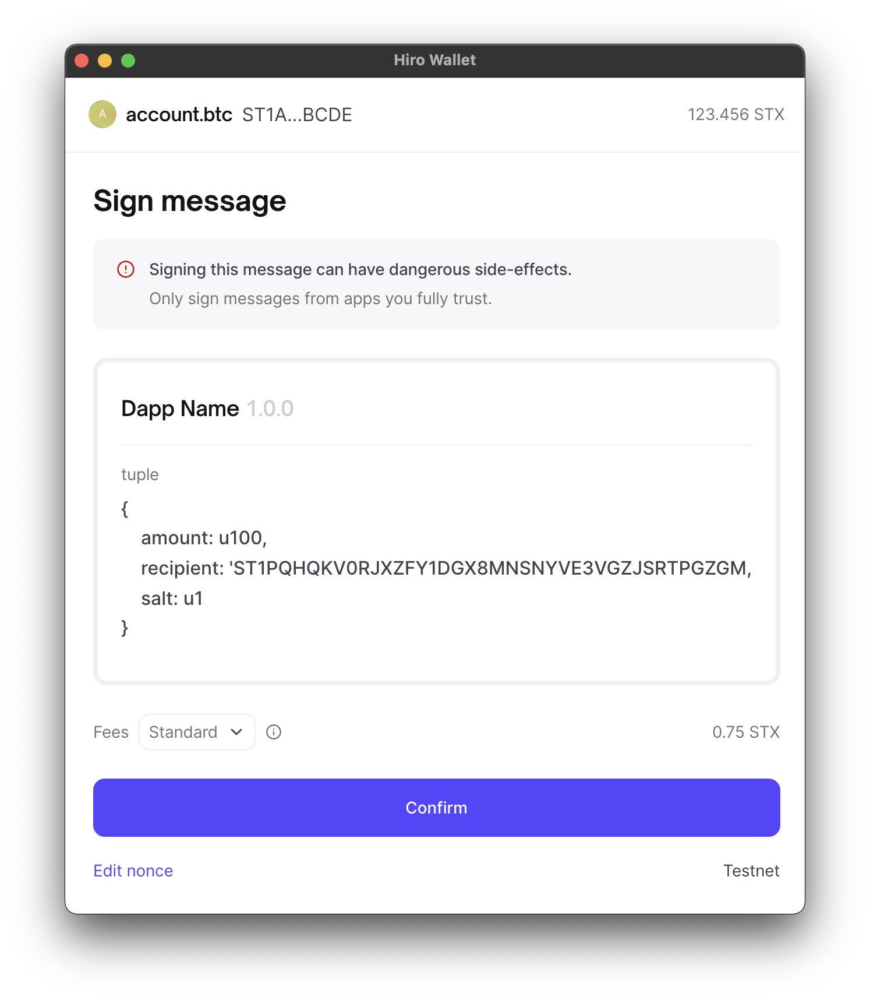

# Preamble

SIP Number: 018

Title: Signed Structured Data

Author: Marvin Janssen <https://github.com/MarvinJanssen>

Consideration: Technical

Type: Standard

Status: Ratified

Created: 28 December 2021

License: CC0-1.0

Sign-off: Jude Nelson <jude@stacks.org>

Layer: Applications

Discussions-To: https://github.com/stacksgov/sips

# Abstract

The Signed Structured Data specification describes a standard way to
deterministically encode and sign Structured Data. Structured Data is data that
can be represented in human-readable format and used in applications and smart
contracts. The aim of the standard is to produce signatures that are
straightforward and inexpensive to verify by smart contracts.

# License and Copyright

This SIP is made available under the terms of the Creative Commons CC0 1.0
Universal license, available at
https://creativecommons.org/publicdomain/zero/1.0/ This SIP's copyright is held
by the Stacks Open Internet Foundation.

# Introduction

Digital signatures are at the heart of blockchains. They allow users to transfer
assets, invoke smart contracts and more, without a designated trusted third
party. To perform these actions, a user signs a transaction and broadcasts it to
the network. However, there are situations in which it is desirable to produce
signed messages that are not transactions. A few common use-cases include:

1. prove to an external application or entity that a user is in control of an
   address;
2. authorise an action to be performed by a smart contract at a later stage
   (like a meta transaction, see below);
3. participate in an off-chain mechanism that is later settled on-chain.

It is important that signed messages are understandable for humans. For
transactions, this is obvious: wallet applications display whom is receiving how
many tokens of what kind. Likewise, the input parameters, function name, and
target contract of contract calls are properly listed. Signed messages that are
not transactions should be no different.

The language properties of Clarity make producing and verifying such signed
messages intuitive. The specification therefore leverages existing standards and
encoding schemes. Messages are represented as native Clarity values and encoded
in wire format in preparation for signing. It also makes sure that these signed
messages are chain and application specific. There is a focus on ease of
verification on the smart contract level.

Below is an example of what a wallet application could show when signing a
SIP018 message.



# Specification

The challenge lies in producing messages that are both meaningful to humans as
well as easy to be processed on-chain. Luckily, Clarity is a strongly-typed
interpreted language. Structured Data is therefore a Clarity Value expression as
detailed in _[SIP002: Smart Contract Language
](https://github.com/stacksgov/sips/blob/main/sips/sip-002/sip-002-smart-contract-language.md)_.
These value expressions are encoded in Stacks wire format, as detailed in
_[SIP005: Blocks and Transactions](https://github.com/stacksgov/sips/blob/main/sips/sip-005/sip-005-blocks-and-transactions.md)_,
and then hashed with SHA256. The resulting hash is used as the input for
signing.

## Definitions

_Clarity Value_: a native Clarity value as expressed in _[SIP002: Smart Contract
Language](https://github.com/stacksgov/sips/blob/main/sips/sip-002/sip-002-smart-contract-language.md)_.

_Meta Transaction_: a meta transaction can be understood of as a transaction
that contains another "transaction". For example, a user may sign a message
that, when received by a particular smart contract, causes it to transfer
tokens. A transaction carrying the signed message will then trigger the
underlying action when it is broadcast.

_SHA256_: a cryptographic hash function producing hashes with a length of 32
bytes.

_Signature_: a proof produced by a signing algorithm, in this case ECDSA with
the `secp256k1` curve, encoded in RSV order.

_Structured Data_: A structured representation of a message to sign expressed as
a Clarity Value.

_Wire format_: the underlying encoding for Clarity Values when generating a
transaction, as expressed in _[SIP005: Blocks and Transactions
](https://github.com/stacksgov/sips/blob/main/sips/sip-005/sip-005-blocks-and-transactions.md)_.

## Formal specification

To obtain a signature _S_ of structured data _D_ using private key _K_:

- `S = signStructuredData(D, K)`; where,

- `signStructuredData(D, K) = sign(messageHash(D), K)`; where `sign` produces a
  `secp256k1` signature of a message hash using private key _K_; and,

- `messageHash(D) = sha256(structuredDataPrefix || domainHash || structuredDataHash(D))`;
  where `structuredDataPrefix` is a static value of `"\x53\x49\x50\x30\x31\x38"`
  (which spells "SIP018" in ASCII), and `domainHash` and `structuredDataHash`
  are as described below.

**Definition of** `domainHash`

The domain hash ensures that messages are chain and application specific. A
`domainHash` is generated out of a `domain` Clarity Value:

- `domainHash = structuredDataHash(domain)` where `structuredDataHash` and
  `domain` are as described below.

**Definition of** `structuredDataHash`

The `structuredDataHash` function calculates a hash _H_ of the input Clarity
Value _D_.

- `H = structuredDataHash(D)`; where,
- `structuredDataHash(D) = sha256(ToCVWireFormat(D))`; where `ToCVWireFormat` is
  a function that encodes an input Clarity Value to its wire format
  representation as described in
  _[SIP005](https://github.com/stacksgov/sips/blob/main/sips/sip-005/sip-005-blocks-and-transactions.md)_.

**Definition of** `domain`

The `domain` is a `tuple` type Clarity Value that represents the domain in which
messages are signed. Its Clarity type definition is as follows:

```clarity
{
	name: (string-ascii len)
	version: (string-ascii len)
	chain-id: uint
}
```

`name` contains a readable application name for which Structured Data is being
signed.

`version` contains a string representation of the application version. The
application developer may choose to change this value to ensure that signed
Structured Data of one version of the application is incompatible with another
version.

`chain-id` contains the ID of the chain the Signed Structured Data is targeting.

The length `len` of the string fields are not important as long as the resulting
`domain` Clarity Value does not exceed the permitted maximum length. It is
encouraged that wallet applications display this information to the user. Other
fields may be added per the discretion of the application developer. For
example, another differentiating field may be a `verifying-contract` that
contains the principal of the contract performing the signature validation.

**Definition of Structured Data**

Structured Data can be any valid Clarity Value. It is assumed that it will
usually take the form of a `tuple` type, as it allows for multiple fields with
readable names to be encoded. The standard does permit it to be another type to
remain flexible. Still, developers should consider the informational content of
requesting a user to sign a simple type like a `principal`, `int`, `uint`, or
`bool`. A tuple can of course contain any type.

A future SIP may define standard types of Structured Data.

## Collisions and replay attacks

Structured Data hashes do not collide with _presign-sighashes_ as currently no
Clarity Value in wire format forms a valid Stacks transaction. Furthermore, the
`0x534950303138` byte prefix ensures that the input always differs in the first
six bytes, as Stacks transactions start with a version byte of `0x00` (mainnet)
or `0x80` (testnet), a four byte chain ID, and end with an authorisation type
that must be `0x04` or `0x05` in order to be valid. A Clarity Value in wire
format starts with a byte in the range of `[0x00, 0x0C]`. The prefix is easy to
remember because it spells "SIP018" in ASCII.

Replay attacks across applications, forks, and other signature-compatible chains
are mitigated by prepending a `domainHash` to the `messageHash`. A `domainHash`
is calculated by hashing a `domain` Clarity Value tuple containing the
application name, version, and chain ID.

This SIP is about signing and verifying application and chain-specific
structured data. Replay protection on the application level is out of scope for
the standard. Application developers need to make sure that their applications
behave properly when they receive the same signed structured data more than
once.

## TypeScript implementation

A reference implementation using `stacks.js` is as follows. The
`signStructuredData` function takes `StacksPrivateKey` and a `ClarityValue` and
will return a buffer of length `65` containing the signature in RSV order.

```ts
import {
  ClarityValue,
  serializeCV,
  signWithKey,
  StacksPrivateKey,
  stringAsciiCV,
  tupleCV,
  uintCV,
} from "@stacks/transactions";
import { createHash } from "crypto";

const structuredDataPrefix = Buffer.from([0x53, 0x49, 0x50, 0x30, 0x31, 0x38]);

const chainIds = {
  mainnet: 1,
  testnet: 2147483648,
};

function sha256(data: Buffer): Buffer {
  return createHash("sha256").update(data).digest();
}

function structuredDataHash(structuredData: ClarityValue): Buffer {
  return sha256(serializeCV(structuredData));
}

const domainHash = structuredDataHash(tupleCV({
  "name": stringAsciiCV("Dapp Name"),
  "version": stringAsciiCV("1.0.0"),
  "chain-id": uintCV(chainIds.mainnet),
}));

function signStructuredData(
  privateKey: StacksPrivateKey,
  structuredData: ClarityValue,
): Buffer {
  const messageHash = structuredDataHash(structuredData);
  const input = sha256(
    Buffer.concat([structuredDataPrefix, domainHash, messageHash]),
  );
  const data = signWithKey(privateKey, input.toString("hex")).data;
  return Buffer.from(data.slice(2) + data.slice(0, 2), "hex");
}
```

## Clarity implementation

Verifying signed Structured Data on Stacks 2.1 requires only minimal code. As
the Structured Data itself is application-specific, it is left out of this
reference. The `verify-signed-structured-data` function takes a structured data
hash, a signature, and a signer, and returns `true` or `false` depending on
whether the signature is valid.

```clarity
(define-constant chain-id u1)
(define-constant structured-data-prefix 0x534950303138)

(define-constant message-domain-hash (sha256 (to-consensus-buff
	{
		name: "Dapp Name",
		version: "1.0.0",
		chain-id: chain-id
	}
)))

(define-constant structured-data-header (concat structured-data-prefix message-domain-hash))

(define-read-only (verify-signature (hash (buff 32)) (signature (buff 65)) (signer principal))
	(is-eq (principal-of? (unwrap! (secp256k1-recover? hash signature) false)) (ok signer))
)

(define-read-only (verify-signed-structured-data (structured-data-hash (buff 32)) (signature (buff 65)) (signer principal))
	(verify-signature (sha256 (concat structured-data-header structured-data-hash)) signature signer)
)
```

# Related work

- [EIP712](https://eips.ethereum.org/EIPS/eip-712) is a standard in Ethereum
  (and adopted by other EVM-compatible chains) describing a similar mechanism
  that enables signing of structured data. Some aspects of this SIP were loosely
  inspired by the standard.
- [EIP191](https://eips.ethereum.org/EIPS/eip-191) now describes various signing
  schemes used in the EVM space. When `personal_sign` was introduced, it allowed
  users to sign data without running the risk of inadvertently signing a
  transaction by adding a prefix to the message. The authors were inspired by
  Bitcoin and thus settled on a message structure of
  `<varint_prefix_length><prefix><varint_message_length><message>`. For
  Ethereum, it effectively took the form of `\x19Ethereum Signed Message:\n`,
  followed by the message length, followed by the message. The `\x19` byte
  correctly encodes the prefix length, which is `25`. However, the message
  length was [mistakenly](https://github.com/ethereum/go-ethereum/issues/14794)
  encoded as an ASCII string and not an actual `varint`. It makes verifying
  messages signed with `personal_sign` needlessly expensive on-chain, as the
  message byte length has to be converted to an ASCII string representation
  before the message hash can be obtained. What is more, the messages signed
  with `personal_sign` do not have a predefined structure which makes it very
  difficult for wallet applications to display them properly.
  [MetaMask](https://docs.metamask.io/guide/signing-data.html#a-brief-history),
  a popular EVM browser wallet extension, assesses if a message passed to
  `personal_sign` is valid UTF-8, and will display it as human-readable text if
  so. Otherwise, it converts the message to a hex string and displays that
  instead. Complex messages cannot be meaningfully expressed in UTF-8 whilst
  still allowing smart contracts to process them efficiently. Applications
  developers thus often resorted to requesting users to sign hashes of complex
  messages, making the data being signed completely opaque to the user.
  Considering these problems and Clarity's inherent readability, there is no
  reason for there to ever be a `personal_sign` equivalent in Stacks.

# Backwards Compatibility

Not applicable

# Activation

This SIP will be considered activated if the following two conditions are met:

1. `to-consensus-buff` or equivalent functionality is added to Stacks 2.1.
2. At least one popular wallet application implements the standard before or
   within one year of the launch of Stacks 2.1.

# Reference Implementations

- https://github.com/MarvinJanssen/stx-signed-structured-data

# Test vectors

## Structured data hashing

Using `structuredDataHash(CV)` with an input Clarity Value.

- CV = `asciiCV("Hello World")`:
  `5297eef9765c466d945ad1cb2c81b30b9fed6c165575dc9226e9edf78b8cd9e8`
- CV = `asciiCV("")` (empty string):
  `3c8f1b104592e3ebb2b2602b3979a27e77f586fb4c655369fa4eccb6d545a0f8`
- CV =
  `tupleCV({"name": asciiCV("Test App"), "version": asciiCV("1.0.0"), "chain-id": uintCV(1)})`
  (domain tuple):
  `2538b5dc06c5ae2f11549261d7ae174d9f77a55a92b00f330884695497be5065`

## Message hashing

Using `messageHash(CV)`, which is
`sha256(Prefix || structuredDataHash(Domain) || structuredDataHash(CV))`.

- Prefix = `0x534950303138` (constant value)
- Domain =
  `tupleCV({"name": asciiCV("Test App"), "version": asciiCV("1.0.0"), "chain-id": uintCV(1)})`
- CV = `asciiCV("Hello World")`
- Message hash:
  `1bfdab6d4158313ce34073fbb8d6b0fc32c154d439def12247a0f44bb2225259`

## Message signing

Using the following parameters:

- Private key =
  `753b7cc01a1a2e86221266a154af739463fce51219d97e4f856cd7200c3bd2a601`
- Corresponding public key =
  `0390a5cac7c33fda49f70bc1b0866fa0ba7a9440d9de647fecb8132ceb76a94dfa`
- Corresponding address: `ST1PQHQKV0RJXZFY1DGX8MNSNYVE3VGZJSRTPGZGM`

And the following inputs to obtain the message hash for signing:

- Domain =
  `tupleCV({"name": asciiCV("Test App"), "version": asciiCV("1.0.0"), "chain-id": uintCV(1)})`
- CV = `asciiCV("Hello World")`
- (Message hash:
  `1bfdab6d4158313ce34073fbb8d6b0fc32c154d439def12247a0f44bb2225259`)

Produces the following signature:

- `8b94e45701d857c9f1d1d70e8b2ca076045dae4920fb0160be0642a68cd78de072ab527b5c5277a593baeb2a8b657c216b99f7abb5d14af35b4bf12ba6460ba401`

Which can be verified in Clarity:

```clarity
(secp256k1-verify 0x1bfdab6d4158313ce34073fbb8d6b0fc32c154d439def12247a0f44bb2225259 0x8b94e45701d857c9f1d1d70e8b2ca076045dae4920fb0160be0642a68cd78de072ab527b5c5277a593baeb2a8b657c216b99f7abb5d14af35b4bf12ba6460ba401 0x0390a5cac7c33fda49f70bc1b0866fa0ba7a9440d9de647fecb8132ceb76a94dfa)
true
```
