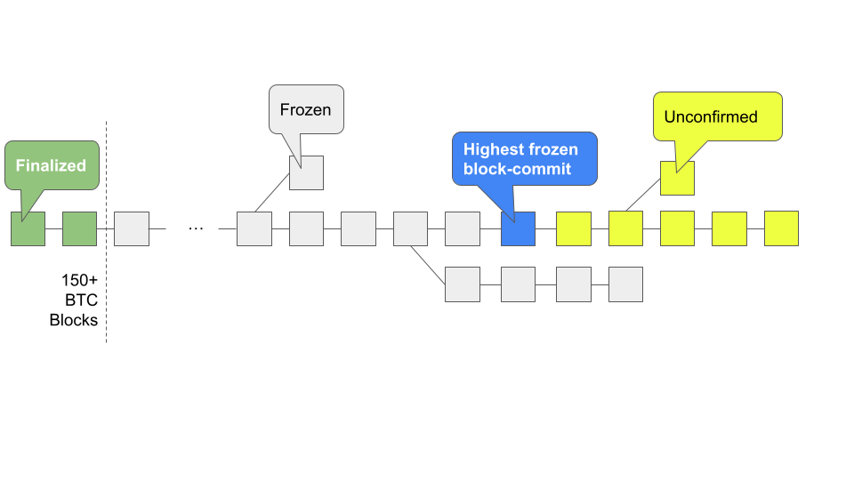
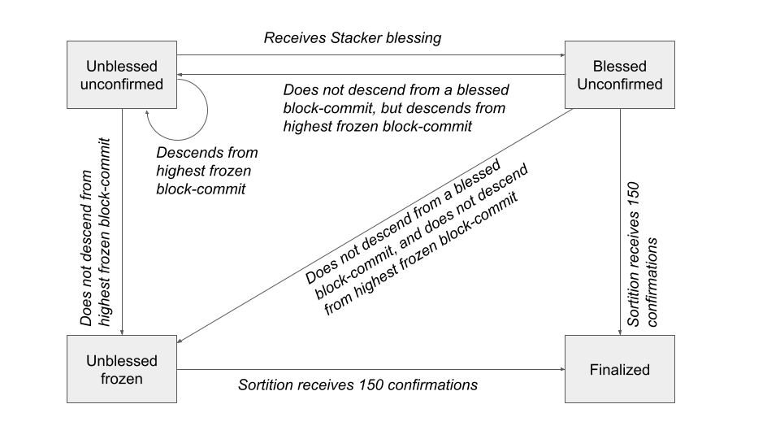

# Preamble

SIP Number: 021

Title: A Trustless Two-way Peg for Bitcoin

Authors: Aaron Blankstein <aaron@hiro.so>, Jude Nelson <jude@stacks.org>, Don Park <donp@trustmachines.co>,
Alie Slade <aslade@hiro.so>, Igor Sylvester <igor@trustmachines.co>, Joey Yandle
<joey@trustmachines.co> 

Considerations: Technical, Governance, Economics

Type: Consensus

Created: 13 December 2022

License: BSD 2-Clause

Sign-off:

Discussions-To:

# Abstract

This SIP proposes the creation of a **trustless two-way peg** in which BTC (the
tokens of the current Stacks burnchain) can be manifested on Stacks as a
SIP-010-compliant fungible token, called sBTC, and later redeemed for the same
number of BTC.  This proposal redefines the act of Stacking to be the act of
maintaining a _peg wallet_, which is used to hold BTC and process sBTC
redemptions.  Stackers are collectively responsible for ensuring that all
liquid sBTC are backed by an equal number of BTC, and that redemptions are
processed in a timely manner.  As a reward, they continue to receive PoX
payouts.

The novel aspects of this proposal over the state-of-the-art two-way pegs are
that:

* It tolerates a reasonable degree of forking under Nakamoto consensus, but
such that no forks are permitted beyond a fixed time horizon (that is, the act
of forking the Stacks chain becomes as difficult as forking Bitcoin).

* It places responsibility for managing the peg wallet in an open-membership set of
network actors (i.e. Stackers).

* It offers a _recovery mode_ whereby PoX
rewards are repurposed to fulfill peg-out requests in the event that Stackers
temporarily fail in their duties.

Two high-level summaries of this SIP and what is would mean for the Stacks blockchain can be found here:

* [sBTC: Design of a Trustless Two-way Peg for Bitcoin](https://stacks.co/sbtc.pdf)
* [Stacks: A Bitcoin Layer for Smart Contracts](https://stacks.co/stacks.pdf)

# Introduction

The lack of a stateful smart contract system on Bitcoin necessitates the
construction of systems in which a representation of locked Bitcoin is traded
within a separate smart-contract-powered blockchain.  These systems aim to
provide a "2-way peg" between the representation of the locked BTC ("wrapped
BTC") and the BTC itself.  At a high level, these systems seek to provide two
primitive operations:

* "Peg-in": a BTC holder rids themselves of their BTC, and in doing so,
receives the equivalent amount of wrapped BTC on the smart contract chain

* "Peg-out": a wrapped BTC holder destroys their wrapped BTC on the smart
contract chain, and receives an equivalent amount of BTC on the Bitcoin chain

While peg-in/peg-out operations are trivial to implement if a trusted
intermediary (a "custodian") can be found to exchange the wrapped BTC for the
BTC and vice versa, a robust, incentive-compatible system remains elusive.  We
identify two key shortcomings in the state-of-the-art 2-way peg systems that we
believe renders them insufficiently robust for widespread usage:

* **Peg safety failures are irrecoverable**.  All existing 2-way peg systems
that we are aware of do not have a way to recover missing BTC should the peg
state ever become corrupted (i.e. through the loss of BTC).  Any such recovery,
if it happens at all, happens out-of-band through the actions of a trusted
intermediary or intermediaries.  This places an enormous barrier to entry for
users, who would need to vet intermediaries before trusting them with large
sums of BTC.

* **Reliance on under-incentivized intermediaries.**  State-of-the-art 2-way
peg systems rely on one or more intermediaries to maintain the peg state, but
do not reward them proportional to the value they create.  Specifically, these
peg intermediaries provide value even when the peg transaction volume is low,
because user confidence in the system depends on the belief that the
intermediaries are nevertheless always available and trustworthy.  For example,
the reason blockchains have a large coinbase relative to their transaction fees
is to incentivize miners to always be available to process transactions.  But
today, there is no 2-way peg system we are aware of that rewards peg
intermediaries in this manner -- there is no "peg coinbase."  Collateralized
pegs suffer a similar shortcoming -- there is little upside to honest
participation, but tremendous downside to going offline, which creates a high
barrier-to-entry for participating as an intermediary.

The system we present, called "sBTC," addresses these two short-comings by
leveraging unique properties of the Stacks blockchain.  Our key insight is that
Stacks' PoX consensus algorithm offers a way to _recover from_ peg safety
failures while also _properly rewarding_ peg intermediaries for the value they
provide.  Specifically:

* We use the fact that the Stacks blockchain "forks with" the Bitcoin
blockchain to implement an open-membership peg wallet maintained by Stackers.
If Bitcoin forks, then both the Stacker set and their wallet forks with it, and
the two resulting Stacker sets and wallets each own BTC on their respective
forks.  This means that Stackers do not lose money from forks, nor do forks
pose a risk to the safety of users' BTC.

* We use the fact that PoX pays BTC
to STX holders to implement a liveness recovery mechanism, whereby some BTC
payouts are repurposed to fulfill peg-out requests should the custodian fail.

* We reward Stackers for staying online to process peg-out requests by
compensating them with BTC via PoX, regardless of the peg's volume.  Stackers
are compensated proportional to their signing power on the peg (i.e how many
STX they locked), in addition to how many peg transactions they process.

By leveraging these properties, sBTC offers the following advantages over the
state-of-the-art:

* **If a majority of Stackers are honest, then sBTC remains safe.**  Every BTC
peg-out is paired with an equivalent, legitimate request from a wrapped BTC
holder, _even if every miner is malicious_.  This is achieved by ensuring that
all Stacking and peg-maintenance operations materialize in all Stacks forks.

* **If a Byzantine fault-tolerant (BFT) majority of miners are honest, then sBTC
remains live**.  All peg-out requests are eventually fulfilled, _even if every
Stacker is malicious_.  This is because Stackers do not have a say in block
production, and Stackers that do not fulfill peg-outs lose their PoX-driven BTC
income from miners.

* **Peg-outs of arbitrary amounts of BTC are fulfilled in
a fixed amount of time** if both Stackers and miners operate with a BFT honest
majority.  This is the "happy path" of the system.

The sBTC system is designed to operate on a variant of Nakamoto consensus while
being incentive-compatible with mining on the canonical fork, and is designed
to ensure that Stackers' most profitable course of action is to faithfully
maintain the peg.  In the service of this, sBTC offers two modes of operation:
the Normal mode, and the Recovery mode.  In **Normal mode**, the sBTC asset is
backed 1:1 by BTC sent to a wallet controlled by a large fraction of Stackers,
as measured by the fraction of locked STX they represent.  Each time BTC is
sent to this wallet (a peg-in operation), an equal number of sBTC are
automatically minted to an address of the sender's choosing.  Stackers respond
to peg-out requests by sending BTC to the requester's Bitcoin address, thereby
maintaining the peg.  The act of responding to peg-out requests automatically
destroys the requester's equivalent amount of sBTC on the Stacks chain.

If the Normal mode encounters a liveness failure for any reason (including loss
of BTC), the system transitions to a Recovery mode until enough Stackers come
back online.  In **Recovery mode**, a fraction of the PoX payouts are
redirected to peg-out requests such that eventually, all outstanding requests
will be fulfilled, even if the Stackers _never_ come back online.  While
considerably slower than Normal mode, the design of Recovery mode ensures all
sBTC can be redeemed so long as the Stacks blockchain and PoX are online.

## New System Properties

With sBTC implemented, the following novel Stacks system properties are
introduced:

* Stacks offers open-membership mining, but now with _limited-depth_ forks.  *
PoX pays the same APY in Normal mode as it does today, but PoX rewards are
instead paid to pending peg-out requests in recovery mode.  Stackers do not
receive any BTC in recovery mode from PoX.

* In Normal mode, there is no limit
on how much BTC can be pegged out at a time.  All peg-out requests are
fulfilled within a fixed amount of time.

* In Recovery mode, all peg-out
requests are eventually fulfilled but with no time limit.

* The set of miners
that could mine in the next Bitcoin block _is known in advance_.

# Specification

The design of both Normal and Recovery modes require careful consideration of
the incentives for Stacks miners, Stackers, and users.  To ensure that
operating the peg remains incentive-compatible with mining on the canonical
Stacks fork, this proposal includes significant changes to the PoX consensus
algorithm.  Specifically, sBTC gives up on arbitrarily deep forks, and instead
supports forks of up to a constant depth.  In exchange, the system supports
arbitrarily large peg-outs in a fixed amount of time and supports
open-membership mining.

The most significant user-facing change in this proposal is that Stackers must
now perform active work to continue receiving PoX rewards.  In this proposal,
Stackers collectively maintain a BTC wallet for the duration of each reward
cycle in which their STX are locked.  This wallet is used to satisfy peg-out
requests.  If Stackers fail to do so in a timely manner, then their STX tokens
remain locked and they do not receive PoX rewards until all peg-out requests
are satisfied.  Their PoX rewards are instead used to fulfill peg-out requests
until they are able to resume their duties.

The most significant change to the internals of transaction-processing is that
**all Stacking-related transactions and all peg transactions must be broadcast
via the Bitcoin chain, as Bitcoin transactions**.  The reason for this is that
these operations must materialize in _all_ Stacks forks.  This is required
because it prevents miners from deciding who the Stackers and peg participants
are (e.g. by deliberately ignoring them in the Stacks mempool).  Instead, when
a miner produces a new Stacks block, it must consider all on-Bitcoin Stacks
operations in all Bitcoin blocks that lie between the Bitcoin block it will
commit to, and the Bitcoin block that chose the parent Stacks block.  This
_prevents_ miners from generating blocks that ignore Stacking and sBTC
activity, since a block that fails to do this will not be valid in the new
consensus rules.  The only way to avoid processing an on-Bitcoin Stacking
transaction is to stop mining altogether.

There are two significant changes to mining.  First, **forks of arbitrary
length are removed**.  Instead, all Stacks blocks must build off of a parent
block no more than 100 Bitcoin blocks in the past.  This de-facto prevents
forks that last longer than about 16-17 hours.  An important consequence of
this is that the history of PoX anchor blocks _may never fork_.  This new
property is needed to implement Recovery mode.  In addition, miners cannot
initiate a fork deeper than 6 blocks unless they have the Stackers' permission
to do so.  This is to ensure that the economic cost of executing a deep reorg
of the Stacks chain exceeds both the miners' mining budgets and 70% of the
value of all locked STX.  This is explained in detail in the "Fork Rules"
section.

The other significant change to mining is that the set of Stacks miners and the
minimum amount of BTC they will commit is known in advance of them mining the
next Stacks block.  To achieve this, the **Stacks blockchain requires each
miner to additionally commit to the amount of BTC they intend to spend in their
next Bitcoin block.**  If their next block-commit does not commit to exactly
this amount, then the block-commit is invalid.  If the miner had not previously
sent a block-commit, or their last block-commit was invalid, or they did not
try to mine in the previous Bitcoin block, then their first subsequent block
commit is guaranteed to lose, but must nevertheless announce the BTC spend in
the following block-commit.  We call this a _block pre-commit_.

## Normal BTC/sBTC Lifecycle

To better explain how and why the system functions the way it does in Normal
mode, a high-level description of the procedure for pegging in and pegging out
is provided below from the perspectives of the various Stacks network
participants facilitating the sBTC peg.

Users:

* Alice wants to materialize 1 BTC on the Stacks chain as sBTC in order
to use it within Stacks contracts.

* Bob, Charlie, Dannielle, and Erica are
Stackers, who represent 90% of the Stacked STX

* Fred eventually receives
Alice's 1 sBTC, and wants to convert it back into BTC.

Bob, Charlie, Dannielle, and Erica independently stack their STX in for the
next reward cycle.  To do so, they each send a Bitcoin transaction that not
only encodes their stack-stx request, but also registers a (Bitcoin) public key
with the system.  At the start of the reward cycle, the `.pox` contract curates
a list of all four participants' Bitcoin public keys.

Alice converts her BTC to sBTC by doing the following:

1. Her wallet queries the `.pox` contract for Bob's, Charlie's, Dannielle's,
and Erica's Bitcoin public keys which they registered when Stacking, as well as
the fraction of Stacked STX they each represent.  It deterministically derives
a Bitcoin address, called the peg wallet address, from these keys (such as a
Taproot address).  The address has the property that as long as any set of
signers representing at least 70% of the Stacked STX have signed, then the
signers can spend the BTC.  2. She sends 1 BTC to the derived address from the
previous step.  This creates a UTXO of 1 BTC that is spendable by some
combination of Bob, Charlie, Danielle, and Erica.  3. In all subsequent Stacks
blocks mined, Stacks miners make sure her sBTC is materialized.  The act of
processing her Bitcoin transaction is the act of minting Alice an equivalent
number of sBTC tokens to her BTC (in this case, 1 sBTC).  This way, Alice
receives 1 sBTC in all Stacks forks that arise henceforth.  4. 1 sBTC shows up
in Alice's wallet

Now that Alice has 1 sBTC, she can use it in any smart contract that supports
it.  The sBTC is represented as a SIP-010 fungible token.

Suppose now that over the course of smart contract interactions with her sBTC,
there eventually exists a Stacks fork in which Fred has obtained 1 sBTC.  Fred
issues a peg-out request by taking the following steps:

1. Fred sends a Bitcoin transaction that encodes a peg-out request, which among
other things indicates the amount of BTC he expects to receive as well as an
address to which to send it.

2. When Stacks miners build a subsequent block,
they ensure that the peg-out request materializes in this Stacks block if it
has not done so already.  In doing so, Fred's peg-out request materializes in
all Stacks forks henceforth.  Note that in Stacks forks where Fred does _not_
own 1 sBTC, the peg-out request will materialize but be _unsatisfiable_.  In
the forks in which he does, the peg-out request will materialize but be
_pending_.

3. After at least 100 but no more than 150 Bitcoin blocks have
passed, users Bob, Charlie, Danielle, and Erica collectively sign a Bitcoin
transaction that sends 1 BTC to Fred's requested address.

4. When miners build
a subsequent block, they ensure that the peg-out fulfillment sent by Bob,
Charlie, Danielle, and Erica materializes in their Stacks block if it has not
already materialized in the fork they are working on.  In doing so, the peg-out
fulfillment materializes in all Stacks forks henceforth.  This _satisfies_ the
peg-out request sent by Fred earlier by burning Fred's 1 sBTC.  Note that this
means that the fork in which Fred had 1 sBTC has the property that no peg-out
requests are unsatisfiable, and all peg-out requests are either pending or
satisfied.

Eventually, the reward cycle ends, and Bob, Charlie, Danielle, and Erica's
public keys expire (along with the Bitcoin address).  In order to receive their
STX back, the four of them send a Bitcoin transaction at the start of the next
reward cycle that forwards the remaining BTC balance to the next peg wallet
address.  This transaction is processed by Stacks miners in subsequent Stacks
blocks, so that in all subsequently-built Stacks forks, these four users will
have unlocked their STX when their lock-up period passes.

## Normal Mode

This section describes the Normal mode of operation.  The key to understanding
the design decisions in Normal mode is understanding the incentives governing
mining.  In particular, miners spend BTC to earn STX, and can generate Stacks
forks.  Anyone with BTC, including peg-out recipients, can be miners.
Therefore, the peg design must ensure that miners' most profitable action is
building on the longest fork they know of.  In other words, the peg design must
prevent miners from making more revenue by doing anything else, such as (but
not limited to) reorging the Stacks chain so as to double-spend a peg-out, or
limit the set of Stackers to confederates who will help miners steal pegged-in
BTC, and so on.

### Peg Wallet Address

In Normal mode, Stackers have the collective responsibility to maintain Bitcoin
sent to the peg wallet address.  To do this, Stackers stack their STX by
sending on-Bitcoin transactions.  These on-Bitcoin transactions encode the
relevant operation in the `OP_RETURN` field (see Appendix A).  When miners
process these transactions, they call the appropriate methods in the `.pox`
contract on the sender's behalf to enact them, much as they do with `stack-stx`
on Bitcoin today.  Right now, only `stack-stx` is supported on-Bitcoin; in this
proposal, this support is extended to _all_ means of Stacking, including
delegated stacking, delegate aggregation commits, stacking extensions, and
delegated stacking extensions.


When a Stacker stacks, she includes a Bitcoin public key in her transaction.
This public key is registered in the `.pox` contract, so that when the PoX
anchor block is mined, **the set of all Stackers' public keys is announced as
part of the PoX reward set**.  Stackers, wallets and other blockchain clients
combine these public keys in a deterministic fashion to produce a peg wallet
address for this reward cycle.  Public keys must be unique, and must never have
been registered before.

Each reward cycle has a peg wallet address.  As seen in the Normal mode
example, users send Bitcoin to this peg wallet address in order to (a) lock
their BTC and (b) mint sBTC.  Stackers spend UTXOs created to this address in
order to fulfill peg-out requests.

In summary, the act of Stacking is no longer just the act of passively
collecting BTC from PoX payouts.  Stackers must additionally maintain this
wallet and process peg-out requests in order for their STX to continue earning
them BTC while they are locked (and to receive them once they unlock).  If the
peg encounters a liveness failure, then Stackers' STX remain locked and do not
earn them BTC until the peg's liveness is restored.

### Peg Transfer

At the end of the reward cycle, the Stackers will learn the next reward cycle's
peg wallet address, and must transfer any outstanding BTC from the now-expired
peg wallet address to the new peg wallet address in order to receive their STX
back.  They do so by crafting a special Bitcoin transaction with an `OP_RETURN`
that indicates that this is the "hand-off" transaction (see Appendix A).  Once
the hand-off transaction is confirmed on the Bitcoin chain, Stacks miners
process it by returning the Stackers' STX in `.pox`.

Due to the fork length limit of 100 Bitcoin blocks, each PoX anchor block, if
it exists, _must_ have been mined in the previous reward cycle.  **This means
that there can be at most one distinct peg wallet address in any Stacks fork,
and the set of Stackers controlling it must have had STX Stacked in the
previous reward cycle**.  This has an important implication for system
liveness: once a peg wallet address expires, _it remains expired forever_.

Stackers must hand off the BTC within 100 blocks of the new reward cycle
starting.  Moreover, they must ensure that the new peg wallet is sent a number
of BTC _equal to or greater than_ the number of sBTC that existed at the end of
their wallet's lifetime.  Note that this means that Stackers must cover at
least some of the cost of peg-out transaction fees themselves; these are not
deducted from the circulating sBTC.  Stackers can transfer this BTC via one or
more hand-off transactions, and Stackers do not need to use the peg wallet to
do so.  Instead, it is sufficient that the new reward cycle's peg wallet has
enough BTC regardless of who sends it.  This enables Stackers to continue to
keep the peg alive, and continue to earn BTC PoX rewards and get their STX
back, even if they are unable to use their peg wallet to do so.

If they do not do this, then a _peg liveness failure_ is declared by the
system, and sBTC switches to Recovery mode at the 101st Bitcoin block in the
new reward cycle.  The Stackers' STX remain locked until Recovery mode can
exit, and their PoX rewards will be redirected to fulfill pending peg-out
requests (see the "Recovery Mode" section).  However, the Stackers can exit
Recovery mode and resume Normal mode by (1) fulfilling every pending peg-out
request they are responsible for in this reward cycle, and (2) transferring
sufficient BTC to the next peg wallet via one or more hand-offs to complete
their tenure.  If some Stacker's STX are locked in the next reward cycle, then
they must repeat (1) and (2) for that reward cycle until either Recovery mode
can be exited, or until their STX's lock-up period passes.

### Peg-In

When a user wants to "peg-in" BTC, she transfers some BTC to the current peg
address, and indicates a recipient Stacks address to hold the minted sBTC.
Once the Bitcoin transaction confirms, miners materialize an equal number of
sBTC to her in her designated Stacks address.  As with all Stacking and peg
operations, this materialization happens in all Stacks forks built upon after
this Bitcoin block.

The sBTC token state is maintained in a boot-address contract called `.sbtc`,
and is exposed to the Stacks blockchain behind the SIP-010 fungible token
standard interface.  Only the block's miner may mint sBTC or burn sBTC, and the
consensus rules for block validation stipulate that each sBTC mint or burn must
correspond to exactly one peg-in or peg-out transaction on the Bitcoin chain.

Once materialized, sBTC tokens can be transferred to any Stacks address.  This
means that different Stacks forks can represent different balances of sBTC.
However, a peg-out request could be valid on multiple Stacks forks but not
others, and could even be invalid on all forks.  This is discussed below.

### Peg-Out Request

Due to the fact that sBTC balances can differ across forks, a peg-out request
may not be valid in all Stacks forks.  To overcome this, the tactic sBTC uses
to implement the peg-out operation is to carry it out as a request that must be
responded to by Stackers (i.e. by sending the BTC).  **Both the request and
response materialize on Bitcoin, and thus in all Stacks forks in the `.sbtc`
contract.**

In order to peg-out, the user must own sBTC in a standard principal address.
This is required to associate the sBTC request with a Bitcoin address to which
to send BTC.  The request is a Bitcoin transaction that commits to the
following information:

* The number of sBTC to peg-out to BTC

* The recipient Bitcoin address to
receive the BTC

* A signature over both of the above from the standard Stacks
principal that owns the sBTC.

When a miner processes a peg-out request, it validates it by first verifying
that the user's address owns at least as many sBTC as requested to peg-out in
this fork.  If she does, then `.sbtc` records that the peg-out request is
satisfiable, and locks up the user's pegged-out sBTC until the peg-out request
is fulfilled.  If she does not, the miner records to `.sbtc` that the peg-out
request is unsatisfiable.  Stackers do not need to consider unsatisfiable
requests.  Moreover, the presence of an unsatisfiable request does not
invalidate the fork (since anyone can send them, even if they don't use
Stacks).

If the peg-out request is valid in at least one Stacks fork, then eventually
the block that validated it may receive more than 100 confirmations.  Because
no Stacks block may be mined on top of a parent who was mined over 100 Bitcoin
blocks ago, the system guarantees that most one such block will be finalized,
and would be part of _all_ Stacks forks going forward.  If such a block is
finalized, then the peg-out request it contains would be considered finalized
as well, and Stackers must respond to it to keep the peg live.  If no such
block ever finalizes -- i.e. the peg-out request remains unsatisfiable in all
forks after 100 Bitcoin blocks, then the user's sBTC are unlocked and once
again show up in their balances.

### Peg-out Fulfillment

To respond to a peg-out request, Stackers send a Bitcoin transaction that pays
some amount of BTC to the peg-out address stipulated in the peg-out request.
The Stackers may send multiple responses for a single peg-out; what matters is
that the peg-out request is fulfilled on time.  If Stackers have received their
peg-wallet hand-off for this reward cycle and fail to fulfill a request within
50 Bitcoin blocks of the request being finalized (i.e. at most 150 Bitcoin
blocks after the request is submitted), then the system transitions to Recovery
mode and PoX payouts are repurposed for fulfilling pending peg-out requests.
If Stackers have not yet received the peg-wallet hand-off, then the peg-out
request must be fulfilled within 50 blocks of its receipt.

Stackers are incentivized to fulfill peg-out requests in a timely manner
because if they do not, their STX will be frozen by `.pox` and used to earn BTC
through PoX in Recovery mode to fulfill peg-out requests.  The only way
Stackers can get their STX back and resume earning BTC is for all of the
finalized peg-out requests they were responsible for fulfilling -- either by
their peg-out wallet, by some other Bitcoin wallet, or by Recovery mode.

While Stackers are _encouraged_ to use the peg wallet's BTC to process peg-out
requests, they are not _required_ to do so.  This enables anyone to keep the
system live even if they cannot use the peg-in wallet for some reason.  The
peg-out fulfillment transaction only requires that the payer specify a Stacks
chain tip (see Appendix A) that identifies the Stackers responsible for
fulfilling the peg-out.  Otherwise, it is sufficient that _anyone_ fulfills all
of the unfulfilled peg-out requests.  Once all such peg-outs are fulfilled, the
Stackers' STX resume earning BTC and may unlock.

### Peg Interactions with PoX

The peg is only active during the PoX reward phase.  The reasons for this are
two-fold.  First, it helps users build confidence in the system by ensuring
that their peg operations in Normal mode will be honored by a known Stacker
set. This way, each user can judge for themselves how well the current
peg-wallet operators behave before deciding whether or not to rely on them.
Second, it ensures that a peg wallet balance is fixed and known in advance for
up to 150 Bitcoin blocks, which gives the current Stackers a chance to muster
the BTC to send to the next Stacker peg wallet via a peg hand-off, even if they
cannot use the current peg wallet in time.

If there is no PoX anchor block mined, then peg-ins and peg-outs are disabled
for the subsequent reward phase.  The current Stackers must nevertheless hand
off their peg wallet's BTC to the first PoX reward sets' peg wallet address to
materialize, regardless of how far in the future it may be, for the peg to
reactivate in Normal mode and for them to recover their STX.  If there is no
PoX anchor block mined, Recovery mode is engaged for that reward cycle to
ensure that peg-out requests can at least be partially fulfilled.

**The PoX prepare phase is retained in sBTC to select the PoX anchor block,
just as it is today.**  Miners burn BTC to vote on the PoX anchor block, which
necessarily falls in the previous reward phase.  Just as in Stacks 2.1, the PoX
anchor block's block-commit will be the block-commit with (a) the most
confirmations in the prepare phase by descendant block-commits, or (b) if there
is a tie, the block-commit with the most BTC burnt to select it, or (c) if
there is still a tie, the block-commit that occurs latest in the Bitcoin chain.
The reason for preserving the prepare-phase as-is is to ensure that the PoX
reward sets, and thus the canonical chain tip, can be determined by light
clients and bootstrapping nodes without having to process full Stacks chain
state.

The removal of long-lived forks from the system removes the possibility of a
deep chain reorg taking place due to the arrival of a late PoX anchor block.
If such a block arrives after its sortition has over 100 confirmations (or
indeed if _any_ such late block arrives), and it is not on the canonical chain,
then the block would simply be ignored by the network.

### Peg Wallet Quorum Failure

It is anticipated that the most likely failure mode sBTC will encounter is a
failure to gather sufficiently many signatures from Stackers to process a
peg-out or a peg hand-off in a timely fashion.  To minimize the chance of this
transitioning the system into Recovery mode, the protocol does not mandate the
use of the peg wallet itself to fulfill peg-outs and peg hand-offs.  Instead,
the protocol only requires that these transactions are valid and fulfilled with
the right amount of BTC.

This design decision permits a vast array of non-consensus-critical remedies
for loss of control of a peg without entering Recovery mode.  For example,
Stackers have the option to do any of the following:

* Anyone can spend their own BTC, including their PoX-earned BTC, to fulfill
peg-outs and peg hand-offs.

* Anyone can borrow BTC to fulfill requests, and
pay it back with BTC from the peg wallet once it is live again.

* Anyone can
refill the peg wallet in the event it no longer backs any sBTC.

Recovery mode engages once either (1) a peg-out or a peg hand-off times out, or
(2) the peg wallet no longer has enough BTC to back all liquid sBTC.
Short-term peg liveness failures can be addressed by the Stackers simply
fulfilling their duties as soon as possible, or by someone wishing to receive
their pegged-out BTC in a timely manner spending some BTC to unblock the peg
wallet.  Longer-term peg liveness failures are more detrimental to the system,
and are addressed through one or more backup scripts (see "Peg Wallet Design").

### Peg Collateralization

A key concern for incentivizing Stackers to faithfully maintain the peg is to
ensure that _foregoing_ their locked-up STX in order to keep the BTC is never
profitable.  To do this, `.sbtc` contract imposes a STX-backed
collateralization limit on the number of sBTC that may be in circulation.  For
example, the system could start with a cap of 200% -- for every BTC pegged in,
there must be 2 BTC-worth of STX participating in Stacking.  However, the
`.sbtc` contract will be designed to permit sBTC holders to vote on what the
collateralization limit should be, or even disable it.  These votes would
happen through Bitcoin transactions, so they materialize in all Stacks forks.

Enforcing a collateralization limit is achievable in-band because each fork's
miners know for each Stacks block how much BTC was spent by all miners to mine
it, and how much BTC the winning Stacks block-commit spent.  No oracle is
necessary, because this data is directly recorded to the Bitcoin chain through
the act of mining.  Therefore, anyone can query a Stacks chain tip and
determine for any interval of time how much BTC a STX ought to be worth, given
a target miner profit margin.  If we assume that miners mine at a perfect
break-even rate, and earn just as much STX as they spend in BTC, then we can
determine a lower bound for how much the Stackers' STX is worth in BTC
(assuming miners are economically rational, and never mine at a loss).

Using this property of Stacks, the sBTC system will examine the set of valid
(i.e. accepted or missed) block-commits over a long window of prior Bitcoin
blocks, and determine how much the Stacked STX are worth in BTC.  The length of
this window is to be determined at a later date, but a longer window is
desirable in order to be confident that miners do not deliberately mine at a
loss in order to create an apparent STX/BTC exchange rate that does not reflect
the market. To this end, the initial window size will be chosen from historic
mining data, and the `.sbtc` contract will determine what the window size will
be on a per-reward-cycle basis through an on-Bitcoin vote (similar to how the
collateralization limit is determined).

If the peg wallet ever receives more BTC than is considered safe by the current
collateralization limit in the `.sbtc` contract, then the system will delay the
materialization of sBTC from subsequent peg-in requests until one of the
following is true:

* Stackers lock up more STX to preserve this over-collateralization ratio *
Enough peg-outs are processed such that the total sBTC is once again worth less
than half of the Stacked STX

* The BTC-denominated price of STX rises
sufficiently so that the sBTC is worth less than half of the Stacked STX

Importantly, sending BTC to the peg wallet when there is not enough STX
collateral does _not_ lead to a loss of funds.  It only delays the
materialization of the sBTC.  Wallet implementations would need to monitor the
amount of circulating sBTC and BTC-determined value of STX in order to help
users avoid accidentally sending BTC to the peg wallet only for it to not
materialize in a timely manner.

The temporary delay of sBTC minting is not treated as a peg liveness failure.
Peg-outs and peg hand-offs continue to execute in Normal mode if this situation
arises.

## Recovery Mode

The sBTC system continues to process peg-outs without a peg wallet, albeit more
slowly, by tapping PoX payouts.  Peg-ins are disabled altogether; any attempt
to peg-in will cause the requestor's sBTC to materialize only after the system
transitions back to Normal mode.  While the act of pegging out sBTC for BTC
will be slower than the Normal mode of operation, the fact that it exists at
all means that as long as both the Stacks blockchain and PoX consensus are
active, then **eventually all sBTC will be redeemed.**  This enables the system
to not only keep working in the event of a peg failure, but also provides a way
for the system to transition back into Normal mode.  The existence of Recovery
mode creates user confidence in the system, because their sBTC is still both
liquid and nominally representative of an equivalent amount of BTC.  The user's
sBTC can even be _traded_ for BTC with someone who does not mind waiting for
the sBTC to be redeemed over time.

### Entering Recovery Mode

The system enters Recovery mode in the event a peg liveness failure is detected
in Normal mode.  To summarize from preceding sections, a peg liveness failure
is declared when any of the following conditions are met:

* A satisfiable peg-out request was finalized on all Stacks forks, but was not
fulfilled within 50 blocks of finalization.

* A new reward cycle began, but
the new peg-wallet does not have enough BTC to back all circulating sBTC as of
the 51st Bitcoin block of the reward cycle.

* The miners did not choose a PoX
anchor block in the preceding prepare phase.

These conditions are checked at each Bitcoin block.  If any of the above
conditions are met, then Normal mode ceases operation and the system
transitions to Recovery mode in the next Bitcoin block.

### Block Pre-Commit

The operation of Recovery mode is solely tied to the blockchain's liveness.
Miners themselves pay BTC to peg-out requests in order to fulfill them, instead
of paying BTC to Stackers.  To make this work, it is important to ensure that
the set of miners do not consistently overpay peg-out requests, as doing so
would impose a moral hazard on behalf of peg-out requesters to force the system
to use Recovery mode and potentially earn more BTC than they are due.  This
requires changing the way miners participate.  In sBTC, the Stacks blockchain
must know two new pieces of information before the next Stacks block is mined:

* Which miners could possibly win the next block

* How much BTC each miner
intends to commit.

If the Stacks blockchain knew this information in advance, then miners could
each calculate in advance how much BTC to set aside for fulfilling a pending
peg-out request.  For example, if there were 5 miners, which each were going to
commit 20,000, 18,000, 16,000, 14,000, and 12,000 satoshis (for a total budget
of 80,000 satoshis), and there was a pending peg-out request for 15,000
satoshis, then the Stacks blockchain could require that the miners paid a
pro-rata share of their block-commits (i.e. 3,750, 3,375, 3,000, 2,625, and
2,250 satoshis, respectively) to the peg-out recipient address in order for
their block-commit to be valid.

In order to determine this information, the sBTC introduces the concept of a
_block pre-commit_.  When a miner submits a Stacks block, it additionally
announces the amount of BTC it intends to spend in the next Stacks block's
block-commit.  If the miner does not spend exactly this BTC in its next
block-commit, or if the block-commit does not arrive in the next Bitcoin block,
it will be treated as invalid, and will not be a candidate for sortition.
However, as it is today, missed block-commits will still be tracked for the
purposes of calculating the miner's sortition weight.

### Peg-Out Fulfillment

When a miner submits a block-commit in Recovery mode, it does not pay the PoX
reward set recipient BTC.  Instead, blockchain builds an alternative _peg-out
queue_ from the `.sbtc` contract's timed out peg-out requests (i.e. those with
over 200 Bitcoin confirmations that have not been fulfilled), and requires
miners to pay to peg-out requesters instead.

Peg-out requests are fulfilled in deterministic random order proportional to
the fraction of pegged-out sBTC they represent.  That is, at each Bitcoin
block, a peg-out request is sampled from the peg-out queue at random
proportional to its sBTC, and miners pay their PoX BTC to that peg-out
requester's address.  This way, each peg-out recipient has a non-zero chance of
receiving at least a partial fulfillment in each Bitcoin block.

Unlike PoX reward sets, the peg-out queue is the same in all Stacks forks.  It
does not matter which Stacks fork a miner builds on; it must pay to the same
scheduled peg-out reward recipient regardless.  This means that even if a miner
receives a peg-out fulfillment from itself and other miners, it cannot
"double-spend" the peg-out request nor the peg-out fulfillment.  Therefore,
mining in Recovery mode is just as incentive-compatible as mining in Stacks
today.

The peg-out queue is not fixed-size.  Instead, an unfulfilled peg-out request
is added to the peg-out queue after it receives 150 Bitcoin confirmations.
There is no equivalent reward set calculation; the request is simply added to
the queue.

Because miners are paying BTC directly to the peg-out requester, there is a
lower bound on how much sBTC the peg-out requester must possess in order to be
fulfilled.  This is simply `number-of-miners * bitcoin-dust-minimum`.  There is
no equivalent "Stacking minimum" like there is in PoX.  If a peg-out request no
longer represents enough sBTC that it can be fulfilled by miners when it is
selected for fulfillment, it is removed from the peg-out queue and the
remaining sBTC is burned.  This means that a small amount of sBTC may be lost
in Recovery mode.  It is expected that users who need to peg-out in Recovery
mode will pool their sBTC in order to minimize per-user loss.

As with PoX, peg-out requests are partially fulfilled two-at-a-time.  A miner's
block-commit transaction pays to at most two peg-out requesters' Bitcoin
addresses.  This removes any incentive for miners to try and transition the
system to Recovery mode in order to save on Bitcoin transaction fees; this
design ensures that miners' operating expenses are the same in both Normal and
Recovery mode.

Once the peg-out queue is empty, the system transitions back into Normal mode.

### PoX Freeze

When the system enters Recovery mode, PoX payouts are halted in the subsequent
Bitcoin blocks and the BTC that miners would have paid are instead paid to
peg-out queue recipients. The Stackers' STX no longer earn them BTC, because by
failing to maintain the peg, Stackers are no longer providing value to the sBTC
system.  This is akin to miners in a blockchain foregoing coinbase rewards by
not mining.  In addition to stopping rewards, the STX are kept in `.pox` until
the system transitions out of Recovery mode, even if the STX would have
unlocked.

When in Recovery mode, all reward address slots in the reward phase are
repurposed for peg-out request fulfillment.  There is no lingering
proof-of-burn period, because there are no unused reward slots.

Recovery mode can last for multiple reward cycles, and new PoX anchor blocks
(and thus new Stacker sets and peg wallets) may be chosen during Recovery mode.
However, the system would remain in Recovery mode until all of the conditions
are met to restore the peg's liveness (see "Leaving Recovery Mode").
Newly-stacked STX would be immediately frozen along with all of the current
STX.  The peg wallet address would be re-generated in each reward cycle, as
before.

To de-risk a permanent quorum failure, the peg wallet address is designed to
have at least two spending conditions:  one condition when the quorum has been
reached (i.e. Normal mode), and one or more conditions that only activate once
a certain number of Bitcoin blocks has passed.  In these conditions, other
signers can recover the Bitcoin and send it to the current peg wallet
(described below).

## Peg Wallet Design

Despite the fact that Recovery mode exists, it is very important that the peg
wallet be designed so as to minimize the chance of a _permanent_ loss of
liveness.  This event is indistinguishable from the outright theft of this BTC
in terms of the downstream consequences to Stacks.  While Recovery mode will
eventually allow all peg-out requests to be fulfilled, the permanent loss of
the peg's BTC will in all likelihood lead to an irreversible loss of confidence
in the system for the foreseeable future.

This has two important implications for the design of the peg wallet address:

* It should be possible to create a peg wallet address that enables BTC
recovery by a different set of keys than the Stackers after enough time has
passed. 

* Because Stackers must generate the peg wallet in advance, it should
be possible for the blockchain -- i.e. STX holders -- to not only determine the
keys themselves, but also determine the means by which these keys are chosen.

To remedy this, the peg wallet will be implemented such that at least two
spending conditions are present:

* **Normal script**: Signature(s) from Bitcoin key(s) that represent 70% or
more of the locked STX may spend the Bitcoin, OR

* **Backup script**: The
Bitcoin block height is at least one reward cycle in the future from the end of
this Stacker set's reward cycle, AND a given backup script is satisfied.

The first script encodes the Normal mode behavior -- enough Stackers are online
to sign a Bitcoin transaction representing at least 70% of the locked STX.

The second script encodes a Recovery behavior.  If there is a peg liveness
failure, then after the  current reward cycle finishes, the peg wallet's BTC
can be spent by satisfying a condition of the backup script.  This backup
script is either decided by STX holders within the `.sbtc` contract itself, or
if no decision is made, the system generates a sensible default backup script.

The principals who can satisfy the backup script are entrusted to send the BTC
to the current peg wallet address, thereby allowing the current peg wallet's
Stacker set to restore the peg's liveness.  To help ensure that this is the
_only_ thing that can be done, the Stacks blockchain will _halt_ if it detects
that the backup script was used to transfer the peg-wallet's BTC to _any other
address_ besides the current peg wallet.

### Creating a Backup Script

Ultimately, the choice of the backup script is made by STX holders voting
through the `.sbtc` contract itself, but via one layer of indirection.  STX
holders vote for a smart contract that implements a "_backup steward_" trait.
This smart contract, in turn, produces the backup script to be used for a given
reward cycle.  Votes are cast on the Bitcoin chain to ensure that they
materialize in all Stacks forks.

The reason for this layer of indirection is to allow a DAO or some other
governance structure to be created for managing the peg backup script, such
that the means by which the script is chosen can be specified at a later date
by the STX holders themselves without a hard fork.  The backup steward
implementation can have its own procedures for voting on which keys are to be
used to generate the script, for example.  This de-risks the possibility that a
backup script generation algorithm proves too untenable for use; such an
untenable algorithm could be replaced in-band.

If no script is decided, then the backup script will be generated such that a
quorum of 50% of the previous reward cycle's stackers (weighted by STX stacked)
may recover the BTC.

### Selecting a Custom Backup Script

The backup steward trait definition would only contain a single method:

```clarity
(get-backup-script (reward-cycle uint) (response (optional (buff 1048576)) (uint)))
```

This method would take the target reward cycle as its sole argument, and
optionally return a Bitcoin script.  The smart contract that implements this
trait is free to take any action it wants to implement this method.

The `.sbtc` contract would enable STX holders to choose the address of this
smart contract through a majority vote on the Stacks chain.  To minimize miner
interference with votes, they would do so by first calling a function that
commits their STX to a salted hash of their preferred contract identifier.
Then, once the transaction finalizes, the `.sbtc` contract would allow anyone
to reveal the hash preimage and salt via a separate function.  This way, miners
do not know what contract is being voted on, and would not know this until
there was no way to censor or reorg the vote.

The act of revealing the backup steward contract address and salt can be done
either through a Stacks transaction that calls into `.sbtc` to do so, or via a
Bitcoin transaction that does likewise (see Appendix A).  If the latter option
is taken, miners are required to process it in any subsequent Stacks block on a
fork that does not yet include it (thereby materializing the revelation in all
forks).

## Fork Rules

This proposal preserves Stacks' Nakamoto consensus in order to remain resilient
in the face of node churn and network unavailability.  The ability to fork
gives the blockchain a degree of resilience not found in traditional replicated
state machine systems (including PoS blockchains): there is no barrier-to-entry
to become a block producer, and the system will converge on the same canonical
fork history as long as there exists a BFT-majority of connected block
producers.

However, a key challenge to designing a 2-way peg between Bitcoin and a
blockchain with Nakamoto consensus is that the blockchain can fork, potentially
leading to inconsistencies between blockchains forks and Bitcoin forks.  Stacks
addresses this challenge in two ways:

* Stacks blocks are tied to Bitcoin blocks, so if Bitcoin forks, the Stacks
blockchain's nodes will automatically track both forks.  This ensures that
Bitcoin forks do not produce inconsistent Stacks forks.  This is the behavior
of the system today.

* Stacks maintains Nakamoto consensus for a fixed number
of Bitcoin blocks.  That is, Stacks can fork independently of Bitcoin, but each
block in Stacks cannot have a parent that was mined more than 100 Bitcoin
blocks ago.  This is a proposed change to the system.

This latter design point is required to ensure that Stackers can redeem sBTC
peg-outs in a timely manner while preserving peg safety.  If Stacks can't fork
beyond 100 Bitcoin blocks, then a peg-out request cannot be invalidated by
Stacks miners after 100 Bitcoin blocks have passed.  While limiting the fork
length is necessary to implement sBTC, it introduces some challenges to
preserving system liveness under adverse conditions: dealing with the threat of
a persistent 51% miner, and dealing with the threat of a miner that does not
disclose blocks.

The reader will recall that Stacks miners produce blocks by first sending a
block-commit transaction to the Bitcoin blockchain, which contains the hash of
the Stacks block.  However, because Stacks is a single-leader blockchain that
can fork, there is no protocol-level requirement for the Stacks miner to ever
broadcast their block to the Stacks network (there are, however, incentives to
do so -- doing so is the only way in which the miner can receive a block
reward).  What this means is that a malicious Stacks miner can effectively
decide the set of chain tips if they win 100 blocks in a row, and halt the
Stacks chain by winning 100 sortitions in a row and never announcing any Stacks
blocks.

This proposal addresses both scenarios in three ways:

* We increase the
economic cost to produce forks after a short time horizon.  To produce a fork
of at least 7 blocks deep, the miner must have the explicit support of a
majority of the locked STX.

* We provide a way for Stackers to preserve the
safety of the peg if the attacker wins up to 99 blocks in a row by culling
forks whose sBTC balance state is inconsistent with the peg state.

* We
provide a way for a majority of Stackers and a minority of honest miners to
work together to thwart a hidden block attack before the attacker can win 100
hidden blocks in a row.

Now, the security budget of the system is no longer just the mining budget.  In
the case of double-spend attacks whereby the attacker unwinds the last 6 Stacks
blocks, we make it so the attacker must control a majority of locked STX in
addition to the majority of mining power.  In both chronic 51% and hidden block
attacks, we make it so that if honest miners can produce and broadcast one
Stacks block for every 100 sortitions, the system will remain live, and the
attacker's fork (hidden or public) will never become the canonical fork if its
sBTC state is revealed to be inconsistent with the honest fork.  To halt the
Stacks chain, the attacker must vastly out-spend all honest miners for 100
Bitcoin blocks.  Even if the attacker succeeds, the peg wallet itself remains
safe -- the only way to steal the peg wallet's BTC is to control 70% of the
locked STX at the time of the attack.

### Block-commit Lifecycle


In this proposal, a Stacks block-commit goes through three phases as the chain
grows: the **unconfirmed** phase, the **frozen** phase, and the **finalized**
phase (Figure 1).



_Figure 1: Finalized, Frozen, and Unconfirmed Stacks block-commits (all
unblessed).  At most one of them is the highest frozen block-commit.  Note the
typo in the figure -- a finalized block-commit is mined **100** Bitcoin blocks
in the past, not 150._

* A Stacks block-commit is **unconfirmed** if it does not yet have 6 Stacks
confirmations, AND, it descends from the highest frozen block-commit (see
below).

* A Stacks block-commit is **frozen** if it either has at least 6
Stacks confirmations OR it does not descend from the highest frozen
block-commit (see below), and the Bitcoin block it is mined in does not yet
have 100 Bitcoin confirmations.

* A Stacks block-commit is **finalized** if it
has at least 6 Stacks confirmations, and the Bitcoin block it was mined in has
at least 100 Bitcoin confirmations.

* Once frozen, it stays frozen.  Once
finalized, it stays finalized.

Because there is at most one Stacks block mined per Bitcoin block, then once
there exists a Stacks fork of 6+ blocks, then there exists exactly one
**highest frozen block-commit** in the chain, which was the most recent Stacks
block-commit to get 6 Stacks confirmations.  The highest frozen block-commit
advances whenever a new Bitcoin block is appended to the Bitcoin chain which
contains a new valid block-commit.

### Stacker Blessings

While a block-commit is in the unconfirmed or frozen phases, it can be in one
of two states: blessed and unblessed (Figure 2).  The introduction of a blessed
versus an unblessed block-commit is what empowers Stackers to help miners
overcome a hidden-block miner, even if the hidden-block miner has the vast
majority of the mining power.  The differences are as follows:

* Unblessed block-commits are just normal block-commits.

* Blessed block-commits
are either selected by a majority of Stackers, or they descend from the
block-commit that Stackers blessed last.

* Miners can build off of any blessed
block-commit (or any of its descendants).  They cannot build off of frozen
block-commits that are not blessed.



_Figure 2: Block-commit states and state transitions.  All non-finalized
block-commits' states, as well as the identity of the highest frozen
block-commit, are re-evaluated upon the arrival of a new sortition, which may
produce at most one block-commit and bless a frozen block-commit (thereby
revoking all outstanding blessings)._

A _blessed_ block-commit is a heretofore frozen block-commit that Stackers
permit miners to build off of.  They permit this in order to enable honest
miners to recover from the scenario where the highest frozen block-commit's
Stacks block is hidden or has a hidden ancestor (rendering it unprocessable).
By blessing a frozen block-commit, Stackers enable honest miners to "fork
around" the unavailable data.

Stackers may select any frozen block-commit to become a blessed block-commit
with a majority vote (as measured by locked STX).  This vote is broadcast to
the network as a Bitcoin transaction to ensure that all Stacks nodes will see
it.  Stackers vote individually; they do not need the peg wallet to be live to
activate a blessing.

The ability to permit mining deep forks introduces the possibility of allowing
malicious miners to reorg the Stacks chain back more than 6 blocks.  However,
the harm that could arise from this is mitigated by the fact that the _only
legitimate reason_ for Stackers to bless a block-commit is if (1) it is an
ancestor of the highest frozen block-commit or (2) the network does not seem to
have the Stacks block for it, or one of its descendants.  Such a scenario will
be widely apparent (meaning that users, wallets, and exchanges would simply
increase the number of required confirmations before accepting transactions).
Similarly, any attempt to abuse the ability to bless block-commits will _also_
be widely apparent.  So, honest miners would be able to identify and ignore
illegitimate blessings should they ever arise, and the only way an illegitimate
blessing could be weaponized to bring harm to users is if the attacker both
controlled a majority of locked STX and mining power.

Once blessed, a block-commit can be in one of two states: **unconfirmed** or
**finalized**.  Miners can build on unconfirmed blessed block-commits _in
addition to_ unconfirmed unblessed block-commits.  They may freely and
individually choose which commits to build off of.

All unconfirmed blessed block-commits descend from the Stacker-blessed
block-commit.  A blessed block-commit that reaches the finalized phase loses
its blessing -- it can no longer be built upon.

There is at most one blessed tree of block-commits in the system at any given
time.  If Stackers bless a different block-commit, then all existing blessings
are invalidated -- the prior blessed block-commits are no longer blessed, and
miners can no longer build atop them.  This gives Stackers the ability to
re-attempt recovery from a hidden block attack should the attacker also attack
the nascent blessed fork, while also ensuring that Stackers do not arbitrarily
open mining to any Stacks block of their choosing (which could be exploited by
malicious miners trying to reorg the chain).

If the longest blessed fork receives more Stacks confirmations than the
canonical fork -- i.e. its tip has a higher height than the heretofore
canonical fork -- then the blessing disappears and this new block becomes the
canonical tip (Figure 3).


_Figure 3: Once a blessed fork (in red) receives more confirmations than the
missing canonical Stacks fork blocks (missing blocks are marked with "?"), then
it becomes unblessed and this fork becomes the new canonical fork, with a new
highest frozen block-commit and a new set of unconfirmed blocks.  Other blessed
forks become frozen._

These new behaviors give the system the following properties.

* There is exactly one highest frozen block-commit across the entire Stacks
chain across all of its forks.  The only exception to this is if there are
fewer than 6 Stacks blocks _anywhere_. 

* The highest frozen block-commit's
height monotonically increases.  When a new Stacks block is mined, its parent
will either be the canonical Stacks tip, or it will be a sibling of an
unconfirmed Stacks block.  In the first case, the highest frozen block-commit's
height increases by 1.  In the second case, the highest frozen block-commit's
height is unchanged.

* When mining off of unblessed block-commits, the highest
frozen block-commit at Bitcoin height N will either be the same as the one in
Bitcoin height N+1, or it will be the parent of the one in Bitcoin height N+1.
This is _not true_ when considering blessed block-commits.

### Rules

By introducing both lifecycle phases and Stacker blessings, this proposal
creates a new fork-choice rule for Stacks: the canonical fork is always tipped
by the highest descendant of the highest frozen block-commit's Stacks block,
even if the block for it is not yet published.

In doing so, the system creates a new miner rule: a miner can mine off of any
descendant of the highest frozen block-commit (i.e. any unblessed
block-commit), and it can mine off of any descendant of a blessed block-commit.
Miners freely and individually choose which member of this set of block-commits
to mine off of.  A miner cannot mine off of any other block-commits.

### Finalization

Once a block-commit receives 100 Bitcoin confirmations, it can no longer be
blessed.

When Stackers fulfill a peg-out request, they invalidate all Stacks forks in
which the peg-out would result in an inconsistent chain state (i.e. someone's
sBTC balance becomes negative).  These forks will never be treated as canonical
as long as they contain such inconsistencies.  As such, the act of Stackers
fulfilling a peg-out request that materializes in Stacks block B is declaring
that any Stacks fork that descends from B might be canonical (i.e. the
canonical fork must include B).

Consequently, the act of processing a peg-out is used to keep the chain alive
even if someone manages to mine 99 block-commits without disclosing their
blocks.  As long as there exists at least one valid publicly-disclosed block,
then Stackers can use it to authenticate and process peg-outs and in doing so,
require that block to be part of the canonical chain.  This enables miners and
Stackers to prevent a hidden-block miner from halting the chain while spending
far fewer resources than the attacker.  It also prevents a 51% attacker from
denying sBTC transfers and peg-outs: if any sBTC transfer materializes in the
honest fork, and Stackers process at least one peg-out on that fork, then the
51% attacker's fork is obliged to _also_ process the _same_ sBTC transfers in
order to keep their fork canonical.

# Related Work

This section is not done yet.  Notes follow.

* PowPeg in RSK

	* Requires HSMs on a majority of Bitcoin miners (brittle;
closed-membership)

	* Has a token with coinbases to incentivize validator
liveness regardless of tx volume (good!)

	* Probably the closest system to what
we're building

* Sidechains / drivechains

	* No incentive for validators to
process transactions, outside of miniscule tx fees

	* No compelling answer for
dealing with sidechain reorgs (Bitcoin miners have to fully validate, which
does not scale)

* Liquid

	* No incentive for validators to process transactions,
outside of miniscule tx fees

	* Closed-membership federation is brittle and its
admission process is opaque

	* Why should users trust certain federation
members' decisions? 

* Merged mining

	* Requires majority Bitcoin miner

participation (risky without 100% participation -- one Bitcoin miner could have
majority merged-mining power, like with Namecoin)

	* Bitcoin miners must
validate merged-mined chain (does not scale)

None of the above can recover from a peg failure.

Marvin Janssen (of Ryder) has a proposal for a "Bitcoin train" taproot script
for recovering from a peg liveness failure that should be given further
consideration.

# Backwards Compatibility

Two properties from the Stacks blockchain are dropped in this proposal:

* **The ability to mine off of any prior Stacks block.**  To date, there has
never been a Stacks block whose ancestor was over 100 Bitcoin blocks back (or
even 10 Bitcoin blocks back).  Every deep fork in Stacks that has ever arisen
was due to a bug, not miners leveraging this feature.  Furthermore, the
necessity of this feature is questionable, since its need is motivated by an
already-catastrophic blockchain failure (in which case, other remedies such as
hard forks would be viable alternatives).

* **The ability for miners to choose their block-commit value on-the-fly.** In
this proposal, miners must choose a block-commit value for the next block they
intend to mine.  However, to date miners do not appear to dynamically adjust
their PoX expenditures every block as it is, so this feature's ongoing utility
is questionable.

# Activation

This section will be filled in with the advice of the CABs.

# Conclusion

This proposal describes sBTC, a novel Bitcoin 2-way-peg that offers a
PoX-powered recovery procedure for temporary peg liveness failures while
rewarding the peg wallet's stewards (Stackers, via PoX) for staying online
regardless of how much or little peg traffic exists.  The proposal sacrifices
forks of arbitrary length in order to handle peg-ins and peg-outs of arbitrary
size in a fixed amount of time in an in-band fashion, while keeping mining and
Stacking running in an open-membership setting.  Building the peg on Stacks
avoids complicated designs related to Bitcoin forking by ensuring that the peg
state exists in all Bitcoin forks.  By making sure that Stacking and
peg-operations materialize in all Stacks forks, we additionally ensure that
mining on the canonical chain is always the most profitable course of action
for miners.

# Appendix A: New Transactions

This section describes the wire formats of the various sBTC Bitcoin
transactions.

### Peg Hand-off Transaction

* **Description**: This is used by the current reward cycle's Stackers to send
the pegged-in BTC to the next reward cycle's Stackers' peg wallet address.

* **Opcode**: `H`

* **Data**

	* **Bytes 3-11**: The reward cycle number
(big-endian) corresponding to the Stacker set doing the hand-off

* **Output 2**: the new peg wallet address

* **Notes**: Anyone can send a hand-off
transaction in order to (re-)fill the current reward cycle's peg wallet.  This
is used to recover from loss of BTC due to transaction fees, or even wallet
theft.


### Peg-In Transaction

* **Description**: This is used by an sBTC user to peg-in BTC and materialize
sBTC. 

* **Opcode**: `<`

* **Data**

	* **Bytes 3-80**: c32-encoded Stacks
address to receive the sBTC

* **Output 2**: the current peg wallet address

### Peg-out Request Transaction

* **Description**: This is used by an sBTC holder to request a peg-out *
**Opcode**: `>`

* **Data**

	* **Bytes 3-11**: The number of sBTC to peg-out, in
satoshis (big-endian)

        * **Bytes 11-76**: A 65-byte recoverable secp256k1 low-S
signature from the sBTC owner's private key(s), over the SHA512/256 hash of the
bytes consisting of

		* the number of sBTC (bytes 3-11 above)

		* Output 2's
scriptPubKey

* **Output 2**: a dust output with the recipient Bitcoin
scriptPubKey

* **Notes:** This representation includes the signature in the
`OP_RETURN` instead of the scriptSig or witness in order to separate the Stacks
account holder from the Bitcoin holder who will send this transaction.  For
example, a Stacks user might receive sBTC but have no BTC with which to fund
the peg-out.  In this case, the Stacks user could use a peg-out service to
create and broadcast a Bitcoin transaction on their behalf (possibly via an
atomic swap on the Stacks chain, in exchange for some sBTC or STX).

### Peg-out Fulfillment Transaction

* **Description**: This is used by the Stackers to fulfill a peg-out request 

* **Opcode**: `!`

* **Data**:

	* **Bytes 3-35**: The Stacks block tip whose chain
state view was used to validate the peg-out request

* **Output 2**: pays to an
existing peg-out request transaction's scriptPubKey

* **Notes**: Anyone can
send this transaction to partially or completely fulfill a peg-out request.  It
does not need to be the Stackers themselves.  If this was sent by Stackers,
then the block and its ancestors effectively must be canonical (or 70% of
Stackers were lying).  This has implications for when peg-outs are fulfilled
when the majority of block-commits' block data is hidden by an attacker.

### Block Pre-commit

* **Description**: This is a modified block-commit transaction in which the
amount of BTC the miner will spend on its next block-commit is disclosed.  

* **Opcode**: (same as a block-commit)

* **Data**: (same as a block-commit)

* **Output 2-3**: (same as a block-commit -- this is either 2 PoX outputs or 1
PoB output)

* **Output 4**: a change address that will be spent in the next
block-commit transaction, whose satoshi value will be equal to the value spent
in the next block-commit's PoX or PoB outputs.

* **Output 5**: change address
for the remaining BTC

* **Notes**: The block pre-commit transaction must
consume both change address outputs.  This not only implements the mining
window, but proves that the miner committed in advance to paying an exact
amount of BTC to mine.

### Backup Steward Contract Reveal

* **Description**: This is used to reveal a STX holder's choice of a backup
steward smart contract. 

* **Opcode**: `b`

* **Data**:

	* **Bytes 3-80**: The contract identifier

* **Output 2** The 20-byte salt, as a p2wpkh scriptPubKey

* **Notes**: Anyone can send this transaction. It will reveal at most one salted
hash in the `.sbtc` contract.  It is expected that most users will just commit
to the salted hash, and privately disclose the contract identifier and salt to
a service that will send this transaction on their behalf.

### Collateralization Parameter Vote

* **Description**: This is used by a Stacker to vote for the parameters of the
peg wallet. 

* **Opcode**: `C`

* **Data:**

	* **Bytes 3-11**: A big-endian
64-bit unsigned integer representing the size of the sample window for which to
derive the STX/BTC exchange rate, based on miner activity.

	* **Bytes 11-13**: A big-endian 16-bit unsigned integer representing the collateralization limit
as a whole-integer percentage. For example, a value of `200` indicates that the
locked STX must be worth at least 200% more than the sBTC in the peg wallet in
order for more sBTC to materialize.

* **Notes**:  Any sBTC holder can send
this transaction.  New parameters take effect in the next reward cycle if (a)
the sender has _not_ touched their sBTC in-between when they voted and when the
reward cycle begins, and (b) the new parameters are backed by at least 70% of
the liquid sBTC.

### Stacker Blessing

* **Description**:  This is used by a Stacker to vote to bless a block-commit.

* **Opcode**: `B`

* **Data:**

	* **Bytes 3-11**: A big-endian 64-bit unsigned
integer representing the absolute Bitcoin block height at which the target
block-commit can be found

	* **Bytes 12-14**:  A big-endian 16-bit unsigned
integer representing the absolute offset in the Bitcoin block at which the
target block-commit can be found

	* **Bytes 14-69**: A 65-byte recoverable low-S
secp256k1 signature over the data between bytes 0 and 14 and the previous
Bitcoin block hash.  The signature must be from the Stacker's peg wallet key.

* **Notes**:  Any Stacker can vote individually.  The system tabulates votes
and declares that a blessing has taken place if a majority of the current
reward cycle's locked STX has voted for the same block-commit.

