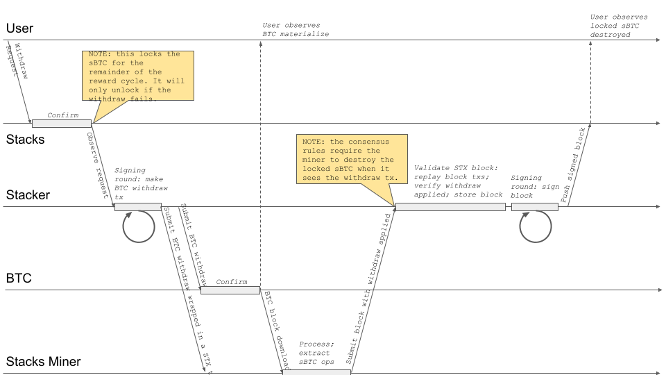
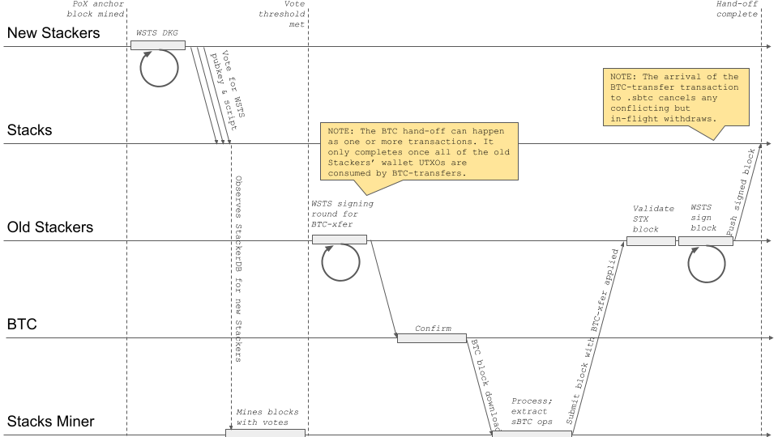

# Preamble

SIP Number: 022

Title: sBTC: Design of a Decentralized Two-way Peg for Bitcoin

Authors:
* Aaron Blankstein <aaron@hiro.so>
* Alie Slade
* Andre Serrano <andre@resident.stacks.org>
* Ashton Stephens <ashton@trustmachines.co>
* Brice Dobry <brice@hiro.so>
* Don Park <donp@trustmachines.co>
* Fernando Foy <fernando@trustmachines.co>
* Friedger Müffke <mail@friedger.de>
* Igor Sylvester <igor@trustmachines.co>
* Jacinta Ferrant <jacinta@trustmachines.co>
* Jesus Najera <jnajera1917@gmail.com>
* Joey Yandle <joey@trustmachines.co>
* Jude Nelson <jude@stacks.org>
* Marvin Janssen <marvin@ryder.id>
* Mike Cohen <mjoecohen@gmail.com>
* Sayak Chatterjee <sayak@trustmachines.co>
* Stjepan Golemac <stjepan@trustmachines.co>
* Tycho Onnasch <tycho@tychoonnasch.com>

Consideration: Technical, Governance

Type: Consensus

Status: Draft

Created: 28 September 2023

License: CC0-1.0

Sign-off:

Layer: Consensus (hard fork)

Discussions-To: https://github.com/stacksgov/sips

# Abstract

This SIP proposes the creation of a **trust-minimized 2-way peg** in which BTC (the
tokens of the current Stacks burnchain) can be manifested on Stacks as a
SIP-010-compliant fungible token, called sBTC, and later redeemed for the same
number of BTC.  This proposal redefines the act of Stacking to be the act of
maintaining an _sBTC wallet_, which is used to hold BTC and process sBTC
redemptions.  Stackers are collectively responsible for ensuring that all
liquid sBTC are backed by an equal number of BTC, and that redemptions are
processed in a timely manner.  As a reward, they continue to receive PoX
payouts.

# Introduction

## Glossary

| Term | Definition |
|:-:|:-|
| stacker | Someone who locks up their STX tokens in order to support the network and earn Bitcoin rewards. Read more about [how stacking helps the network][HOW-STACKING-HELPS-THE-NETWORK-GIST]. |
| stacks miner | Someone who spends Bitcoin to participate in miner elections and create the new block on the Stacks blockchain. Miners are rewarded with STX tokens. |
| stacker signer | A daemon which runs as an event observer to the Stacks node. |
| delegated signing | The act of signing on behalf of either one or many stackers, where the weight of the signer is the aggregate weight of the stackers it's signing for. |
| PoX | **Proof of Transfer:** Miners commit Bitcoin to the Stacks network in order to be eligible to mine blocks. The more Bitcoin a miner commits, the higher their chances of winning the block lottery selected via cryptographic sortition. If a miner wins the block lottery, they are awarded STX tokens as a reward. Further details are in [SIP-007][SIP-007-LINK]. |
| DKG | **Distributed Key Generation:** A cryptographic process in which multiple parties contribute to the calculation of a shared public and private key set. The participation of a threshold of honest parties determines whether a key pair can be computed successfully. |
| WSTS  | **Weighted Schnorr Threshold Signature:** A single aggregate signature, indistinguisable from a standard Schnorr signature, that is generated by a number of signers whose aggregate weight must exceed a given threshold. WSTS is the system used for DKG in this proposal. [WSTS GitHub][WSTS_GITHUB]. |
| 2-way peg | A mechanism that allows users to transfer assets between two blockchains in a trustless way by locking assets on one blockchain and issuing equivalent assets on the other blockchain. |
| deposit | When a BTC holder rids themselves of their BTC, and in doing so, receives the equivalent amount of wrapped BTC on the smart contract chain. Elaborated upon in this SIP. |
| withdrawal | When a wrapped BTC holder destroys their wrapped BTC on the smart contract chain, and receives an equivalent amount of BTC on the Bitcoin chain. Elaborated upon in this SIP. |
| clarity | The smart contracting language used on the Stacks blockchain. This smart contracting language is used on the Stacks blockchain to support programatic control over digital assets within the Stacks blockchain. Details are in [SIP-002][SIP-002-LINK]|
| contract dataspace | A set of tables of data which only the smart contract that owns the dataspace may modify. Details are in [SIP-002][SIP-002-LINK]. |
| StackerDB |  A best-effort replicated database controlled by a smart contract, which Stacks node operators can opt-in to hosting.  Unlike a smart contract's data space, a StackerDB's data is not consensus-critical. Developers use StackerDBSet to host and replicate auxiliary smart contract data for the purposes of some (off-chain) application. |

## Problem Statement

The lack of a stateful smart contract system on Bitcoin necessitates the
construction of systems in which a representation of locked Bitcoin is traded
within a separate smart-contract-powered blockchain.  These systems aim to
provide a _2-way peg_ between the representation of the locked BTC ("wrapped
BTC") and the BTC itself.  At a high level, these systems seek to provide two
primitive operations:

* "Deposit": a BTC holder rids themselves of their BTC, and in doing so,
receives the equivalent amount of wrapped BTC on the smart contract chain

* "Withdraw": a wrapped BTC holder destroys their wrapped BTC on the smart
contract chain, and receives an equivalent amount of BTC on the Bitcoin chain

While deposit/withdraw operations are trivial to implement if a trusted
intermediary (a "custodian") can be found to exchange the wrapped BTC for the
BTC and vice versa, a robust, incentive-compatible system remains elusive.  We
identify two key shortcomings in the state-of-the-art 2-way peg systems that we
believe renders them insufficiently robust for widespread usage:

* **Peg safety failures are irrecoverable**.  All existing 2-way peg systems
that we are aware of do not have a way to recover missing BTC should the peg
state ever become corrupted (i.e. through the loss of BTC).  Any such recovery,
if it happens at all, happens out-of-band through the actions of a trusted
intermediary or intermediaries.  This places an enormous barrier to entry for
users, who would need to vet intermediaries before trusting them with large
sums of BTC.

* **Reliance on under-incentivized intermediaries.**  State-of-the-art 2-way
peg systems rely on one or more intermediaries to maintain the wallet state, but
do not reward them proportional to the value they create.  Specifically, these
intermediaries provide value even when the transaction volume is low,
because user confidence in the system depends on the belief that the
intermediaries are nevertheless always available and trustworthy.  For example,
the reason blockchains have a large coinbase relative to their transaction fees
is to incentivize miners to always be available to process transactions.  But
today, there is no 2-way peg system we are aware of that rewards
intermediaries in this manner -- there is no "2-way peg coinbase."  Collateralized
2-way pegs suffer a similar shortcoming -- there is little upside to honest
participation, but tremendous downside to going offline, which creates a high
barrier-to-entry for participating as an intermediary.

## Proposed Solution

The system we present, called "sBTC," addresses these two short-comings by
leveraging unique properties of the Stacks blockchain.  Our key insight is that
Stacks' PoX consensus algorithm offers a way to _recover from_ 2-way peg safety
failures while also _properly rewarding_ intermediaries for the value they
provide.  Specifically:

* We use the fact that the Stacks blockchain "forks with" the Bitcoin
blockchain to propose an open-membership sBTC wallet maintained by Stackers.
If Bitcoin forks, then both the Stacker set and their wallet forks with it, and
the two resulting Stacker sets and wallets each own BTC on their respective
forks.  This means that Stackers do not lose money from forks, nor do forks
pose a risk to the safety of users' BTC.

* We use the fact that PoX pays BTC
to STX holders to propose a liveness recovery mechanism, whereby some BTC
payouts are repurposed to fulfill withdraw requests should the custodian fail.

* We reward Stackers for staying online to process 2-way peg operations by
compensating them with BTC via PoX, regardless of the peg's operation volume.  Stackers
are compensated proportional to their signing power on the peg (i.e how many
STX they locked) regardless of how many deposit and withdrawal transactions they process.

By leveraging these properties, sBTC offers the following advantages over the
state-of-the-art:

* **If a majority of Stackers are honest, then sBTC remains safe.**  Every BTC
withdraw is paired with an equivalent, legitimate request from a wrapped BTC
holder, _even if every miner is malicious_.  This is achieved by ensuring that
all Stacking and wallet maintenance operations materialize in all Stacks forks.

* **If a Byzantine fault-tolerant (BFT) majority of miners are honest, then sBTC
remains live**.  All withdraw requests are eventually fulfilled, _even if every
Stacker is malicious_.  This is because Stackers do not have a say in block
production, and Stackers that do not fulfill withdraws lose their PoX-driven BTC
income from miners.

* **Withdraws of arbitrary amounts of BTC are fulfilled in
a fixed amount of time on the happy path** if both Stackers and miners operate with a BFT honest
majority.  If they do not, then withdraws of arbitrary amounts of BTC
are fulfilled eventually by _redirecting_ Stackers' PoX payouts to fund withdraw
requests.

To support this, sBTC offers two modes of operation: **Normal mode** and **Recovery mode**.

In **Normal mode**, the sBTC asset is
backed 1:1 by BTC sent to a wallet controlled by a large fraction of Stackers,
as measured by the fraction of locked STX they represent.  Each time BTC is
sent to this wallet (a deposit operation), an equal number of sBTC are
automatically minted to an address of the sender's choosing.  Stackers respond
to withdraw requests by sending BTC to the requester's Bitcoin address, thereby
maintaining the peg.  The act of responding to withdraw requests automatically
destroys the requester's equivalent amount of sBTC on the Stacks chain.

If the Normal mode encounters a liveness failure for any reason (including loss
of BTC), the system transitions to a Recovery mode until enough Stackers come
back online.

In **Recovery mode**, a fraction of the PoX payouts are
redirected to withdraw requests such that eventually, all outstanding requests
will be fulfilled, even if the Stackers _never_ come back online.  While
considerably slower than Normal mode, the design of Recovery mode ensures all
sBTC can be redeemed so long as the Stacks blockchain and PoX are online.

## Scope

This proposal only describes Normal mode, and leaves Recovery mode to be described
in a future SIP.

This proposal, if ratified, would be executed by at least two hard forks:  one
to implement Normal mode, and a follow-on hard fork to implement Recovery mode.
This SIP is designed to leverage features proposed by [SIP-021][SIP-021-LINK], and can only
activate if it is ratified beforehand or concurrently with this SIP.

The Recovery mode SIP cannot activate without this SIP first being ratified.

# Specification

The proposed [SIP-021][SIP-021-LINK] upgrade would do away with Stacks forks, which vastly
simplifies the sBTC design over what would be needed for a fork tolerant system.
Importantly, miners and Stackers cannot "roll back" sBTC operations, meaning that deposit
and withdraw operations follow at-most-once semantics. This lack of "fork risk" means
that the system can support arbitrarily large amounts of BTC deposited and withdrawn,
assuming that at least 70% of Stackers by weight are trustworthy.

The sBTC system state is materialized in a boot contract called `.sbtc`.  This
contract, like `.pox-4`, is managed in part by the node itself.  In particular,
the node writes sBTC state from Bitcoin into the data space of `.sbtc` (such as
via a private function that only the node can call), so that it can be accessed
by smart contracts in Stacks.

The following sections describe the Normal mode of operation.  Recovery mode is
left for future work, but is summarized in a separate section after Normal mode.

## Deposit

To deposit bitcoin into the system a transaction will need to be generated
that sends the UTXO to the generated address with two script spending paths.
One with a special payload in an `OP_DROP` unlock script will need to be sent to
the signer's pubkey, and another with a timelocked refund path. Then, a function
with within the `.sbtc` smart contract will need to be called that does the following:

1. Verifies that the Bitcoin transaction is included in the bitcoin block of a specified height
2. Verifies the inclusion of the 2 script paths tap leaves in the output (the root is generated from the 2 tap leaves)
3. Records the existence of the Transaction ID, the amount sent and the time at which it was committed in the `.sbtc` data space and marked as _pending_ (the height at which this Bitcoin transaction was included, not at which it was verified in the Clarity contract)

Stackers, via their signer daemons, already subscribe to the Stacks blockchain
for events.  The act of writing new sBTC deposit state to the `.sbtc` contract
generates such an event -- an event that alerts the signer daemons to begin a
signing round to act on the deposit.

In the happy path, at least 70% of Stackers agree that the deposit transaction is
valid, and they generate a contract-call to the `.sbtc` contract to
_authorize_ the deposit by minting the equivalent number of sBTC tokens to
an account address of the user's choice.  Crucially, the transaction is signed
collectively by Stackers via a WSTS signing round -- it is authenticated via a
Schnorr proof and the Stacker's aggregate public key.  This way, _only_ the
Stackers can authorize the deposit, and only via a 70%+ majority vote.

Once stackers generate the authorization transaction, they make it available to
miners via their StackerDB instance, and require the current miner to include it
in the next block they produce.  If the miner does not do so, then the Stackers
will not sign the block; this all but compels the miner to include the
transaction.

The user must wait until their deposit transaction confirms on Bitcoin before the
sBTC tokens materialize.  This is required because Stacks miners only process
pending Stacks-on-Bitcoin transactions for Bitcoin blocks up to but _excluding_
the Bitcoin block in which their `block-commit` landed.

The act of fulfilling a deposit with an affirmative vote is effectively a promise
made by Stackers to users to ensure that the sBTC minted wll remain fully backed
by the BTC the user submitted.  This BTC may only be spent to fulfill withdrawals,
or to process a DKG wallet hand-off.  Either way, the user's BTC will be spent by
Stackers before they can reclaim it via the spending fulfillment script.

***TODO: https://github.com/stacks-network/sbtc/issues/349: Create Deposit Procedure Diagram***

### Deposit Bitcoin Transaction

The deposit Bitcoin transaction sends Bitcoin to the generated address with the
following script spending paths:

1. The sbtc payload is embedded in the script that sends the Bitcoin to the signer's pubkey
    - `<sbtc_payload> DROP <signers_pubkey> CHECKSIG`
2. The Refund path
    - `<block-height> CHECKLOCKTIMEVERIFY DROP <user_pubkey> CHECKSIG`

### Deposit Clarity Contract Call

The `.sbtc` clarity contract will need to contain a function that, when called,
does the following:

1. Verifies that the Bitcoin transaction is included in the bitcoin block of a specified height
2. Verifies the inclusion of the 2 script paths tap leaves in the output (the root is generated from the 2 tap leaves)
3. Records the existence of the Transaction ID, the amount sent and the time at which it was committed in the `.sbtc` data space (the height at which this Bitcoin transaction was included, not at which it was verified in the Clarity contract)

#### `.sbtc` Contract Function

```lisp
submit-commitment(
  (burn-height uint)
  (tx (buff 4096))
  (header (buff 80))
  (tx-index uint)
  (tree-depth uint)
  (txproof (list 14 (buff 32)))
  (signers-pubkey (buff 33))
  (principal-buff (buff 151))
  (refund-pubkey (buff 33))
  (version (buff 1))
  (output-index uint)
)
```

The following are the function parameters:

| Parameter      | Description                                                        |
| :------------- | :----------------------------------------------------------------- |
| burn-height    | Block height in which the Bitcoin transaction is included          |
| tx             | Raw Bitcoin transaction data                                       |
| header         | Bitcoin block header of the commitment Bitcoin transaction         |
| tx-index       | Index at which the Bitcoin transaction is found in a Bitcoin block |
| tree-depth     | Depth of the merkle tree where the Bitcoin transaction is included |
| txproof        | Merkle proof of inclusion of the Bitcoin transaction               |
| principal-buff | Address to which the sBTC is to be minted in buffer format         |
| signers-pubkey | Public key of the signers in compressed format                     |
| refund-pubkey  | Public key to be used in the refund path (x-only)                  |
| version        | Version of the script                                              |
| output-index   | Index of the output that is being verified for a commitment        |

#### Conditions

There are two conditions calling to the `submit-commitment` clarity contract:
1. A Transaction can only be used once to limit a malleability attack vector
2. Only one output may be used as a deposit per transaction (this is imposed in the case that verifying multiple outputs is too expensive)

The payment in the original transaction must be above a `.sbtc`-defined threshold,
in satoshis.  This _minimum deposit_ value is used to prevent users from spamming the
system with dust deposits.  Stackers can vote to adjust the minimum deposit.

### Stacker Authorization Transaction

The authorization transaction contains the following data:

* The quantity of BTC sent to the sBTC wallet.

* The address to which the sBTC should be minted.

* A vote "yes", "no", or "abstain" to carry out the deposit, to deny the deposit,
  or to record that no agreement could be reached (respectively).

* A bitmap of which stackers voted.

* A pointer to the deposit transaction's UTXO

* The Bitcoin redeem script for the user's payment.

The Stackers must verify that the script contains the aforementioned spending
fulfillment conditions, _and no others_.  The script is disclosed on the Stacks
chain in order to (1) allow 3rd parties to authenticate the script and (2) check
the Stackers' work in order to hold them accountable.

On successful execution, the sBTC will be minted to the user-specified Stacks
account, and the redeem script will be stored in the `.sbtc` contract for
posterity.  The `.sbtc` contract does not attempt to parse or validate the
redeem script; instead, it stores the voting results and bitmaps for posterity
and keeps track of the single consolidated UTXO generated from all the approved
deposit requests.

The signing bitmap will include a map of both those who vote to accept and those
who vote to reject because the set of Stackers must prove that at least 70% of them
by weight were online when the vote was taken; if less than 70% of signers by weight
are voting then this is a liveness failure on the Stackers' part, and both their PoX
payouts and peg-ins will be stopped until Stackers can reach quorum.

There is no transaction fee for the Stacker authorization transaction.  Stackers
instead require the miner to include it for free in their blocks by withholding
block signatures until it is included.

### Failure Modes and Recovery

There are several places where a deposit can fail.  First, the Stackers may fail
to complete a signing round that achieves the 70% threshold.  One of the
following outcomes will happen:

* The Stackers produce a deposit authorization with at least 70% of the STX
  voting against it.  In this case, the sBTC is not minted, and the user can
later reclaim their BTC once the subsequent reward cycle finishes (i.e. the
reward cycle _after_ this current reward cycle).

* The Stackers are unable to come to agreement on "yes" or "no".  In this case,
  the Stackers record this outcome by submitting each Stacker's individual votes as
a bitmap to the `.sbtc` contract.  This is a vote to abstain.  No sBTC will be
minted, but a record of how each Stacker voted is preserved.  The user later
reclaims their BTC once the subsequent reward cycle finishes.

* A new set of Stackers come online as part of a new reward cycle starting while
  the deposit request is pending.  In this case, the deposit request is cancelled
-- the new Stackers cannot act on it.  The spending conditions of the
deposit script will permit the user to reclaim their Bitcoin later.

* The Stackers are unable to complete a WSTS signing round.  In this case, the
  sBTC system freezes until the Stackers are able to come back online -- no
deposits or withdraws will be processed.  Freezing
and thawing the system are discussed in a subsequent section.

Second, the miner can fail to include the deposit authorization transaction from
the Stackers.  This would prevent the Stackers' vote from being recorded in
`.sbtc`.  If this happens, then Stackers refuse to sign any blocks until they
see a block which contains the as-yet-unmined authorization transaction(s).  If
need be, Stackers themselves can spend some BTC to become miners in order to
push their transactions through.

### Transaction Fees

The user pays the transaction fee for both their sBTC deposit transaction and
the consolidation transaction required to combine its deposit with all UTXOs into
the peg wallet. In practice, this means that a deposit transaction requires
approximately two times the fees of an equivalent transaction to an arbitrary
Bitcoin pubkey.

Stackers do not pay a STX transaction fee, but instead require miners to include their
deposit authorization transaction in the next block they sign.

## Withdraw

Withdrawing is the act of redeeming sBTC for BTC (Figure 2).
To redeem sBTC for BTC, the user first sends a Stacks transaction to `.sbtc`
to indicate the following:

* How much sBTC they would like to redeem

* The Bitcoin address to which the BTC will be sent

This request is queued up in the `.sbtc` data space, which Stackers (through
their signer daemons) observe and react to.  When the transaction confirms, the
user's requested sBTC is locked until the end of the next reward cycle -- the
user cannot spend it while Stackers are considering the request.



_Figure 2: Protocol diagram for a successful withdraw request.  The user submits
a withdraw request to Stacks, which locks their requested sBTC tokens until the
start of the next reward cycle.  If the withdraw succeeds, then they receive BTC from
the Stackers (minus a BTC transaction fee), and their sBTC gets burnt._

When Stackers see the withdraw request they execute a WSTS signing round to
generate a Bitcoin transaction from the sBTC wallet's UTXO which pays out to the
user's requested address.  Because all deposited BTC is spendable by the current
set of Stackers via an aggregate Schnorr signature, Stackers simply create the
scriptSigs for the wallet UTXO to fund a fulfillment UTXO for all users that
requested a successful withdrawal.

Because fulfilling the redemption request occurs through WSTS, there is a
possibility of a quorum failure.  As such, the Stackers may instead vote to
abstain or even to refuse the withdraw request.  This is explained in the
"Failure Modes" section.

The approved withdrawal requests are aggregated into a single withdrawal
BTC transaction from the wallet UTXO.

The BTC redemption transaction contains the following fields:

* An `OP_RETURN` identifying the withdraw request in the `.sbtc` contract

* A new UTXO that redeems all approved withdrawal request's sBTC for BTC

Once the Stackers have created the BTC redemption transaction, they send it
to the Bitcoin peer, and send a Stacks transaction with a copy of the Bitcoin
transaction to `.sbtc`, so that the transaction is _also_ stored publicly in the
`.sbtc` contract's data space.  This is done for failure recovery: if the
Bitcoin transaction does not confirm quickly, the Stackers can try again (see
below).  Also, the existence of the signed Bitcoin transaction in the `.sbtc`
data space serves as proof that the Stackers handled the withdraw request in a
timely manner, even if it was not confirmed on Bitcoin as quickly as desired.
When the `.sbtc` contract processes the copy of the BTC redemption transaction,
it marks the UTXOs it consumes as "tentatively used" so that a
concurrently-generated BTC redemption transaction dees not also use them.

Once the BTC redemption transaction confirms on Bitcoin, a Stacks miner
processes it as a Stacks-on-Bitcoin transaction.  The act of processing this
transaction is the act of calling into the `.sbtc` contract to mark the pending
sBTC withdraw as fulfilled.  This burns the user's locked sBTC, and marks the
withdraw operation as complete.  It also updates the `.sbtc` transaction's
knowledge of the wallet's UTXO to be the transaction that was created to fulfill
the withdrawals.

### Withdraw Congestion

A key responsibility of the `.sbtc` wallet is to keep track of which Bitcoin
UTXOs are under the control of the sBTC wallet, and which ones are tentatively
consumed and tentatively produced by in-flight BTC redemption transactions.
This is necessary because the system has no way of guaranteeing that a BTC
redemption transaction will ever be confirmed.  Instead, by keeping track of the
in-flight UTXOs this way, Stackers may process multiple BTC redemptions in
parallel while waiting for them to confirm.

That said, the rate at which sBTC withdraw requests arrive may exceed the rate at
which Stackers can fulfill them.  If there are not enough unused UTXOs to
fulfill a withdraw request, then Stackers _instead_ send a collectively-signed
Stacks transaction to `.sbtc` that NACKs the withdraw request.  This unlocks the
user's sBTC.  The user may try again later.

It is possible that the BTC redemption transaction does not confirm for some
time, or even at all.  This can happen if the BTC transaction fee is too low,
for example.  In this case, few or no wallet UTXOs would be in a usable state,
since they would all be tied up by in-flight Bitcoin transactions.

Stackers have a few tactics to handle this congestion:

1. They can replace-by-fee (RBF) in-flight transactions, such as by prioritizing the transactions
whose inputs represent the highest value. The extra BTC to pay the fee would come from
the sBTC wallet UTXOs.

2. If there is not enough BTC in the consumed UTXOs to do the above, then the Stackers would
double-spend the in-flight transactions by consuming additional wallet UTXOs
(which themselves may be in-flight) to increase the transaction fee.  This may
invalidate some other in-flight transactions; these transactions would need to
be re-issued.

3. If there is insufficient BTC available to increase the fee, then Stackers themselves would
need to create a UTXO for the sBTC wallet from their personal funds (e.g. their
PoX payouts) to cover the fee.

Regardless of which tactic is taken, the Stackers would need to also _replace_ the
copy of the in-flight Bitcoin transaction in the `.sbtc` contract, so the
`.sbtc` contract can update its view of the available wallet UTXOs.  This would
be achieved by a contract-call to `.sbtc` to carry out the replacement.  As
before, Stackers would require miners to include this transaction in their
blocks in order for the blocks to be signed.

The act of replacing an in-flight transaction in `.sbtc` is also the act of
updating its knowledge of how much _extra_ BTC was spent out of the sBTC wallet
to cover the additional transaction fee.  This is important for the hand-off
(see below).

### Transaction Fees

Bitcoin transaction fees are unavoidable.  This proposal calls for users to pay
the BTC transaction fee for both their deposits and withdraws.  As such, there
exists a minimum BTC redemption amount:  a given redemption request, minus the
fees required to produce a BTC redemption transaction, must be worth more than
the Bitcoin dust minimum (5,500 satoshis).  If it is not, then the Stackers NACK
the withdraw request.

Stackers set the required satoshis/vbyte transaction fee rate in the `.sbtc`
contract data space, so users can discover it at any time.  Stackers update this
fee rate via a collectively-signed contract-call transactionto `.sbtc`, which
they again require miners to include in their blocks.  This way, Stackers can
protect themselves and the system from congestion collapse if they notice that
transaction fees on Bitcoin are spiking.

### Failure Modes and Recovery

A withdraw operation can fail in the following ways, and has the following
remediations:

* The Stackers may not produce the redeem transaction.  If they cannot reach
  quorum, but can complete a WSTS signing round, then they instead
send a _Stacks_ transaction to `.sbtc` which indicates that no quorum can be met.
This is a vote to abstain.  In this case, the user's sBTC remain locked until
the end of the reward cycle, at which point a new set of Stackers will be
selected, permitting them to try again.

* There may not be enough free UTXOs to create a redeem transaction.  If this
  happens, then Stackers must collectively sign a Stacks transaction
that instead marks the withdraw request.  This unlocks the user's sBTC, so they can try
again once the system is no longer congested.

* The redeem transaction may never confirm.  If this happens, then the Stackers
  use one of the aforementioned tactics to retry the transaction.  They must do
this in order to free up the UTXOs that this transaction consumes.

* The set of Stackers expires when they hand off the sBTC wallet's BTC to a new set
  of Stackers.  If this happens, then all pending sBTC withdraw requests for the
old set of Stackers are cancelled.  Users will need to re-request a withdraw to
the new Stackers.

* The Stackers may fail to run a WSTS signing round after a given time out (e.g.
  10 Bitcoin blocks).  If this happens, then the
  system freezes until enough Stackers can come online.  This has penalties,
which are described in a following section.

## BTC Transfer

A new set of Stackers assumes responsibility for the sBTC wallet during the
prepare phase for their reward cycle.  Due to SIP-021, the Stacks blockchain
never forks, which means that the new set of Stackers is known immediately after
the last non-prepare-phase Stacks block is mined (since this block is guaranteed
to be the PoX anchor block).

Once the PoX anchor block is known, the miner _immediately_ calculates the new
PoX reward set (including the list of Stackers and their signing keys), and
writes them into the `.pox-4` data space.  This would be required by the
consensus rules -- the block would not be valid if the miner did not do this.
Today, the node does this calculation
at the end of the prepare phase, and only writes the state into the sortition
database's MARF; this proposal calls for doing this at the start of the prepare
phase, and writing this information into both places.

### Deciding the New sBTC Wallet

Once the new set of Stackers is known, they have 99 Bitcoin blocks to carry out
a WSTS DKG round amongst themselves and write the aggregate public key and BTC
redeem script into the `.sbtc` contract (Figure 3).  The former is needed by
SIP-021 already for signing blocks.  The latter is needed for users to correctly
produce a deposit UTXO, which contains the hash of a redeem script; the redeem
script determines the sBTC wallet's address.



_Figure 3: Protocol diagram of a BTC-transfer.  Once the PoX anchor block is known,
the new Stackers proceed to execute a WSTS DKG and post the new aggregate public key and
wallet redeem script to Stacks.  The old Stackers help them do this by requiring miners
to include their votes in their blocks as a prerequisite for signing them.  Once the
new public key and wallet redeem script have reached 70% support, the old Stackers send
one or more Bitcoin transactions which consume all of the current wallet's UTXOs (including those
for in-flight withdraws) and create new ones for the new sBTC wallet.  Once all old UTXOs
are consumed, then the hand-off completes.  The act of processing a BTC-transfer transaction
updates the .sbtc contract's wallet UTXO tracker per the consensus rules._

The Stackers write the aggregate public key and BTC redeem script
through an on-chain vote.  The new Stackers submit their votes as zero-fee Stacks
transactions, which they share with existing Stackers so they can compel miners
include them in blocks (and should this fail for any reason, Stackers can also send
their votes as normal Stacks transactions).  Once the aggregate public key and
BTC redeem script clinches at least 70% support as weighted by the new stackers'
stacked STX, then the new Stackers are treated as active and ready to execute the sBTC wallet
hand-off.

By executing this vote, Stackers are granted a degree of agility in determining
the terms of the BTC redeem script.  For example, they can require users to wait
for two reward cycles to receive their BTC back in the event of a deposit
failure, instead of one.  As another example, they can pass control of the sBTC
wallet to a user-controlled DAO in the event that there is no spending activity
for a number of reward cycles.

### Passing the BTC

Once the new Stackers have voted on the new wallet redeem script with 70%
support, the old Stackers transfer the BTC to the new sBTC wallet address.  These
transactions are Stacks-on-Bitcoin transactions, and contain an `OP_RETURN` that
marks them as such to all Stacks nodes.

Miners process a BTC-transfer transaction by updating the data space of the
`.sbtc` contract as follows:

* The pointers to old UTXOs consumed by the BTC-transfer are deleted, and
  pointers to the new wallet's UTXOs are inserted.  If the UTXOs for a pending
BTC redemption transaction are instead consumed by a BTC-transfer, then not only
are these UTXOs deleted, but also the transaction is queued for re-try by the
new Stackers.  See below.

* The `.sbtc` contract's BTC balance for the next reward cycle is updated by the amount transferred.

Once all of the outstanding UTXOs have been consumed by BTC-transfers, the new
Stackers begin handling deposits and withdraws for the next reward cycle.

### Recovery of BTC Fees

The transfer is complete once all of the old wallet's UTXOs (both unused and
pending) are consumed by BTC-transfer transactions.  However,
the total BTC in the sBTC wallet will be slightly less than the
total amount of sBTC.  This is because (1) the old Stackers will have had to pay
transaction fees to send the BTC-transfer transactions, and (2) Stackers
may have had to RBF a stuck BTC redeem transaction.

These losses due to BTC fees are distributed across sBTC accounts lazily when the user next
deposits BTC, transfers the sBTC, or attempts to redeem it.  The `.sbtc` contract keeps track
of the total supply of sBTC, the balance of each account, and the number of
missing satoshis, so it has enough information to make this happen.  When the user attempts
to do any of the above with sBTC, the `.sbtc` contract will burn an amount of sBTC equal to
the following:

```
min(1, (sbtc_balance * missing_satoshis) / sbtc_supply)
```

In other words, the sBTC holder will pay a pro-rata share of the missing BTC
fees, or it will pay a single satoshi of it.  An sBTC holder pays at most once
per reward cycle.  Eventually, as long as there is
sBTC activity on-chain, the number of sBTC in circulation will be made equal to
the number of satoshis in the sBTC wallet.  If this fails to happen by the end of
the reward cycle, then the sBTC system freezes and a Stacker may need to
manually pay BTC into the sBTC wallet to recover the fee (see "System Recovery
from Frozen Wallet").

### Restarting In-Flight Transactions

If a BTC-transfer happens while there are in-flight redemption transactions, then the old
Stackers must double-spend the in-flight redemption transactions.  The `.sbtc`
contract identifies which in-flight redemption transactions would be affected by
observing which UTXOs the BTC-transfer transaction consumes.  Each affected in-flight
redemption transaction would be marked as cancelled, and the user's sBTC
unlocks.  The user will need to try the request again.

### Transfer Fees

The peg wallet will need to be transferred every reward cycle, which is an unbounded number of
transfers with no tie to the numebr deposit and withdrawal requests. This means there is
no way to charge a fee that, at the moment of deposit or withdrawal, is
guaranteed to adequately pay for the peg transfer fees for the duration of the pegged
Bitcoin's tenure.

To pay for peg wallet transfer fees without dipping into user funds, this SIP proposes
the following mitigation strategies.

1. During the prepare phase, the traditionally burned bitcoin will instead be placed into the peg wallet. See [SIP-001][SIP-001-LINK]
2. The protocol will maintain a warchest that can receive donations and be siphoned from if the wallet budget for transfer fees runs dry.
3. Allow arbitrary third parties to donate BTC to the peg wallet.
4. Dip into stacker rewards such that the stackers pay for the peg transfer.

The peg wallet's transfer fee funds are considered empty when the amount of BTC in
the peg wallet is less than or equal to the total sBTC within the system. The total
amount of sBTC in the system will be made accessable via the `.sbtc` contract's
and be tracked within the contract's data space.

### Failure Modes and Recovery

The BTC-transfer can fail in the following ways:

* The user sends BTC to an old wallet address, based on an old redeem script. In
  this case, the redeem script terms automatically guarantee that the user's BTC
becomes spendable to them after a timeout happens.

* No blocks get mined in the prepare phase.  In this case, the old Stackers
  proceed with the BTC-transfer as soon as block-mining is back online.  If this
takes until after the prepare phase, then the sBTC system freezes (see below).

* Miners do not mine new stackers' votes.  This is ameliorated by having the
  _old_ Stackers store a copy of the vote transactions, and requiring miners to
include them in order for their blocks to be signed.

* The new Stackers fail to reach quorum on a wallet redeem script, or fail to
  execute a WSTS signing round or DKG.  In this case, the system freezes until the new Stackers come online
(see below).

* The old Stackers fail to transfer all of their wallet's UTXOs to the new
  wallet by the start of the new reward cycle.  This is mitigated by the system
keeping their STX locked and halting PoX payments until the old Stackers finish
the hand-off (see below).

* While hand-off is proceeding, an in-flight redemption transaction gets
  double-spent by a BTC-tranfer transaction.  If this happens, then the user
retries the withdraw request (their request is cancelled automatically once any
of their in-flight redemption transactions' are consumed by a different
Stacks-on-Bitcoin transaction).

## Freezing and Thawing

In the preceding sections, there are failure modes whereby the system can
freeze.  This can happen if the Stackers fail to execute a WSTS signing round or
DKG, or fail to vote for a new sBTC wallet redeem script.  If the system freezes,
then STX unlocks do not happen, and PoX payouts do not happen either, for as
long as the system is frozen.  Instead, miners pay to a burn address, and the PoX
system refuses to unlock STX.  The only way the STX can unlock and PoX payments
resume is if the system can be thawed.  If the system remains frozen across two
reward cycle boundaries -- i.e. the current set of Stackers remain frozen and
the subsequent set remain frozen, then the Stacks blockchain halts.

To thaw the system:

* On deposit, the system can freeze if Stackers cannot complete a WSTS signing
  round to vote to accept, reject, or abstain from a deposit request, and the
deposit requests remains pending for too long.  To thaw
the system, the Stackers would need to come back online and acknowledge all
pending deposit transactions.  If the system remains frozen across a prepare
phase, then the system can be thawed by the Stackers passing the BTC to the new
set of Stackers, which would cancel the pending deposit requests.

* On withdraw, the system can freeze if Stackers cannot complete a timely signing
  round to vote to process the withdraw.  To thaw the system, Stackers would need
to come back online to either fulfill all pending withdraw requests, or NACK them.
If the system remains frozen across a reward cycle boundary, then it
thaws if the old Stackers are able to transfer their
BTC to the new Stackers.  This act will cancel all pending sBTC withdraw
requests.

* On BTC-transfer, the system can freeze in one of two ways:  the new Stackers
cannot vote on a new aggregate public key and redeem script before the end of
the reward cycle, or the old Stackers cannot hand off all of the BTC to the new
Stackers by the start of the new reward cycle. The only way to thaw the system
is for the new Stackers to eventually complete their vote and the old Stackers
send over the BTC before the next PoX anchor block is mined.  If the system
remains frozen this way, and the next PoX anchor block is mined, then the Stacks
blockchain halts.

### System Recovery from Frozen Wallet

In the event that the BTC gets "stuck" and Stackers are unable to access it, the
system will support a variation of a deposit transaction called a _donation_.
The only difference between a deposit and a donation is that the donation does
not materialize sBTC.  It merely gives Stackers some BTC with which to fulfill
withdraws.  This feature is meant to enable Stackers to recover lost BTC and
unfreeze the system, should the need ever arise.

## Capital Limits

**No capital limit will be imposed on the system.** Instead, the protocol will rely
on at least 31% of signers by weight identifying themselves to bring transparency
and accountability to the system. In practice, achieving a greater than 70%
voting weight for colluding malicious signers will likely be prohibitively
difficult.

## Future Work: Recovery mode

This SIP proposes implementing the aforementioned Normal mode for sBTC.  A
follow-up SIP may propose a Recovery mode, whereby instead of burning BTC while
the system is frozen, the BTC is instead repurposed to directly fulfill pending
withdraw requests.  While withdraw fulfillment will be considerably slower, at
least the sBTC users will eventually be made whole in the event of a
catastrophe.

In Recovery mode, sBTC deposits would cease and all pending sBTC deposits would be
cancelled.  Withdraws would be fulfilled in first-in first-out order from
redirected PoX payouts.  Once a withdraw request has been
satisfied -- i.e. the requester's BTC address has
received _at least_ as many satoshis as reqeusted from the redirected PoX
payouts -- then the withdraw request completes and the next requester's withdraw
is processed.

Once the Stacks blockchain supports Recovery mode, the system would continue
operating even if the system was frozen for many reward cycles.  The blockchain
would not halt; instead, it would continue its operation to fulfill all withdraw
requests while the BTC is seemingly inaccessible to Stackers.  PoX payouts and
STX unlocks would only resume once the current set of Stackers control
enough BTC to back each sBTC token, and are able to fulfill pending sBTC
withdraws.

The system would transition back to Normal mode once all pending withdraw
transactions have been fulfilled, and once the current set of Stackers possess
enough BTC to cover all outstanding sBTC tokens.

# Related Work

There are several other systems which implement a wrapped BTC asset on a
different chain.  The key difference between most of them and sBTC is that the
nodes which control the BTC wallet use a closed-membership protocol to decide
which parties can enter and leave the set.  In detail:

## WBTC

This is a closed membership system.  It is made up of
50+ merchants and custodians with keys to the WBTC
multi-sig contract on Ethereum. End users purchase wBTC directly from
authorized merchants, and often the experience is fast.  However, WBTC deposits and
withdrawals can only be performed by authorized merchants and custodians.

Although the merchants manage issuance and redemption, all BTC backing WBTC is held
by a single company (BitGo).

## RBTC

This is a closed membership system.  Nine organizations supporting the Powpeg,
and there is no direct control of Bitcoin multi-sig private keys. Peg operations
settle to Bitcoin via merge mining on RSK side-chain.

## BTC.b

This is a closed membership system.  It is operated by eight wardens (relayers)
and a private codebase, secured by an SGX enclave. The SGX enclave only
processes transfers when it receives approvals from at least 6 of the 8 Warden nodes.

## LBTC

This is a closed membership system.  Over 50 members of Liquid Federation manage multi-sig
contract.  Only federation members can process withdrawals.

## tBTC

This is an open membership system, where the BTC is managed by a
rotating set of randomly selected nodes which manage a threshold
wallet.  However, it incurs fork risk because it does not operate atop Bitcoin.

sBTC implements a state of the art solution whereby network validation is open
and permissionless -- anyone can run a validator to secure the sBTC network
 -- and where transactions settle to Bitcoin which benefit from 100% of
Bitcoin's reorg resistance.

# Backwards Compatibility

This SIP would be a hard fork.  It would introduce a boot contract `.sbtc` and
would alter the semantics of PoX such that token unlocks and PoX payouts could
be halted based on pending sBTC operations.

However, the act of Stacking would remain the same as before.

# Activation

This SIP can activate in one of the following ways:

## Concurrent with SIP-021

If the implementation of this SIP is ready and merged to the default branch
of the reference Stacks blockchain implementation by the time SIP-021 activates,
then this SIP also activates.

## As a Future Hard Fork

If this SIP does not ship with SIP-021, then a follow-on hard fork will be
needed to activate it.  To activate this SIP, a Stacker vote will need to be
taken to assess how they feel about running and maintaining the sBTC wallet, in
addition to their block-signing responsibilities in SIP-021.

In order for this SIP to activate, the following criteria must be met by the set
of Stacked STX:

* At least 80 million Stacked STX must vote _at all_ to activate this SIP.  This
  number is chosen because it is more than double the amount of STX locked by
the largest Stacker at the time of this writing (reward cycle 69).

* Of the Stacked STX that vote, at least 80% of them must vote "yes."

The act of not voting is the act of siding with the outcome, whatever it may be.
We believe that these thresholds are sufficient to demonstrate interest from
Stackers -- Stacks users who have a long-term interest in the Stacks
blockchain's succesful operation -- in performing this upgrade.

### How To Vote

If a user is Stacking, then their STX can be used to vote in one of two ways,
depending on whether or not they are solo-stacking or stacking through a
delegate.

The user must be Stacking in any cycle up to and including cycle XXX.  Their vote
contribution will be the number of STX they have locked.

#### Solo Stacking

The user must send a minimal amount of BTC from their PoX reward address to one
of the following Bitcoin addresses:

* For **"yes"**, the address is `11111111111113HsRpPNMeEx832RFD`.  This is the
  base58check encoding of the hash in the Bitcoin script `OP_DUP OP_HASH160
0000000000000000000000007965732d73627463 OP_EQUALVERIFY OP_CHECKSIG`.  The value
`0000000000000000000000007965732d73627463` encodes "yes-sbtc" in ASCII, with
0-padding.

* For **"no"**, the address is `11111111111111UPKuxspbviuahfQ`.  This is the
  base58check encoding of the hash in the Bitcoin script `OP_DUP OP_HASH160
000000000000000000000000006e6f2d73627463 OP_EQUALVERIFY OP_CHECKSIG`.  The value
`000000000000000000000000006e6f2d73627463` encodes "no-sbtc" in ASCII, with
0-padding.

From there, the vote tabulation software will track the Bitcoin transaction back
to the PoX address in the `.pox-4` contract that sent it, and identify the
quantity of STX it represents.  The STX will count towards a "yes" or "no" based
on the Bitcoin address the PoX address sends to.

If the PoX address holder votes for both "yes" and "no" by the end of the vote,
the vote will be discarded.

Note that this voting procedure does _not_ apply to Stacking pool operators.
Stacking pool operator votes will not be considered.

#### Pooled Stacking

If the user is stacking in a pool, then they must send a minimal amount of STX
from their Stacking address to one of the following Stacks addresses to commit
their STX to a vote:

* For **"yes"**, the address is `SP000000000000YB5ECPQ6RKMCFY7R9VE`.  This is
  the c32check-encoded Bitcoin address for "yes"
(`11111111111113HsRpPNMeEx832RFD`) above.

* For **"no"**, the address is `SP00000000000003EDWPQ6RKMCC56TBVT`.  This is the
  c32check-encoded Bitcoin address for "no" (`11111111111111UPKuxspbviuahfQ`)
above.

From there, the vote tabulation software will track the STX back to the sender,
and verify that the sender also has STX stacked in a pool.  The Stacked STX will
be tabulated as a "yes" or "no" depending on which of the above two addresses
receive a minimal amount of STX.

If the Stacks address holder votes for both "yes" and "no" by the end of the
vote period, the vote will be discarded.

## For Miners

There is only one criterion for miners to activate this SIP: they must mine the
Stacks blockchain up to and past the end of the voting period.  In all reward
cycles between cycle XXX and the end of the voting period, PoX must activate.

## Examples

### Voting "yes" as a solo Stacker

Suppose Alice has stacked 100,000 STX to `1LP3pniXxjSMqyLmrKHpdmoYfsDvwMMSxJ`
during at least one of the voting period's reward cycles.  To vote, she sends
5500 satoshis for **yes** to `11111111111113HsRpPNMeEx832RFD`.  Then, her 100,000
STX are tabulated as "yes".

### Voting "no" as a pool Stacker

Suppose Bob has Stacked 1,000 STX in a Stacking pool and wants to vote "no", and
suppose it remains locked in PoX during at least one reward cycle in the voting
period.  Suppose his Stacks address is
`SP2REA2WBSD3XMVMYS48NJKS3WB22JTQNB101XRRZ`.  To vote, he sends 1 uSTX from
`SP2REA2WBSD3XMVMYS48NJKS3WB22JTQNB101XRRZ` for **no** to
`SP00000000000003EDWPQ6RKMCC56TBVT`. Then, his 1,000 STX are tabulated as "no."

# Reference Implementation

The reference implementation of this SIP is being developed in
https://github.com/stacks-network/stacks-blockchain.

[SIP-001-LINK]:
https://github.com/stacksgov/sips/blob/main/sips/sip-001/sip-001-burn-election.md
[SIP-002-LINK]:https://github.com/stacksgov/sips/blob/main/sips/sip-002/sip-002-smart-contract-language.md
[SIP-007-LINK]:
https://github.com/stacksgov/sips/blob/main/sips/sip-007/sip-007-stacking-consensus.md
[SIP-021-LINK]:
https://github.com/stacksgov/sips/blob/main/sips/sip-021/sip-021-nakamoto.md
[WSTS_GITHUB]:https://github.com/Trust-Machines/wsts/
[HOW-STACKING-HELPS-THE-NETWORK-GIST]:
https://gist.github.com/jcnelson/802d25994721d88ab7c7991bde88b0a9