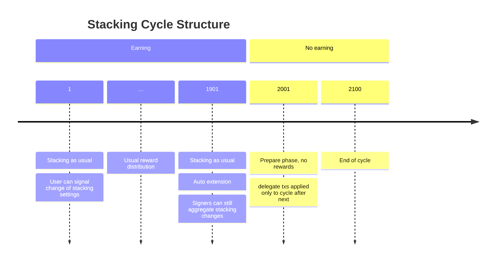

# Preamble

**SIP Number:** XXX

**Title:** Improved Stacking Protocol

**Authors:**

- Friedger Müffke ([friedger@ryder.id](mailto:friedger@ryder.id))

**Consideration:** Technical

**Type:** Consensus

**Status:** Draft

**Created:** 2025-04-01

**License:** BSD 2-Clause

**Sign-off:**

**Discussions-To:**

- [Stacks Forum Discussions](https://forum.stacks.org/t/remove-cool-down-cycle-in-stacking/17899)

# Abstract

This SIP proposes a change to the stacking process so that stackers can change their stacking settings without the so-called cooldown cycle. Furthermore, the relationship between stackers
and signers is strengthened and stacking overall is simplified.

The specification defines that

- solo stackers and delegating stackers have to follow the same flow and use the same contract functions: All users delegate block voting power to signers.
- stackers can change their stacking settings for the next cycle before the prepare phase, including the chosen signer (switch pools).
- locked Stacks token are locked for 1 cycle at a time and that the locking period is extended by another cycle if the user does not request to unlock tokens.
- delegated stacking tokens are locked immediately.
- stacking rewards are received by the Bitcoin address specified by the signer.
- locking Stacks tokens is protected by a new type of post conditions, enabling stacking through a contract in a single transaction.

# Introduction

## Current Situation

Currently, the stacking protocol has a few aspects that make using and integration stacking harder than it could be:

- There are two groups of stackers: solo stackers and delegated stackers. They use different sets of PoX contract functions.

- When using a contract for stacking, the contract needs to be added as an allowed pox contract. This requires a separate transaction.

- Solo stackers do all transactions with their cold wallet holding the whole STX balance. They need to make a transaction at least once every 12 cycles (6 months). In contrast, delegated stackers need to do only a single transaction with their wallet for the entire stacking.

- Signers make off-chain agreements with pool operators regarding revenue sharing.

## Glossary

| Term                 | Definition                                                                                                                                               |
| -------------------- | -------------------------------------------------------------------------------------------------------------------------------------------------------- |
| **Cooldown Cycle**   | The period of 1 stacking cycle where stackers cannot stack their STX tokens because their tokens are unlocked only at the beginning of a stacking cycle. |
| **Signer**           | The node operators that verify and confirm proposed blocks by miners.                                                                                    |
| **Delegation (old)** | delegating the management of stacking.                                                                                                                   |
| **Delegation (new)** | delegating the voting power for proposed blocks.                                                                                                         |
| **PoX Contract**     | The smart contract that users interact with to lock their tokens.                                                                                        |

## Problem Statement

The current stacking process has two different paths, one for solo stackers, one for delegated stackers,
resulting in a more complex user experience and more complex code.

The process is defined by a prepare phase of 100 bitcoin blocks that is used to find an anchor block
for the next stacking cycle. Stackers must lock
their Stacks tokens before the
prepare phase, i.e. before the 2000th block of the current stacking cycle. Furthermore, Stacks
tokens are locked for a locking period that always ends at the beginning of a cycle, i.e. after the
prepare phase. Therefore, the current implementation of Stacking includes a period where Stacks
tokens are unlocked and cannot earn stacking rewards (Cooldown Cycle).

The current PoX contract allows users to lock Stacks tokens during the prepare phase. This is too late for the next cycle
and the tokens are locked without earning stacking rewards for one cycle.

The cooldown cycle for unstacking from a pool presents a problem for network decentralization.
As a stacker, when I delegate to a signer and that signer does not perform and gets low yield,
I get penalized for switching. In today's model with cooldown cycles, users get double penalized
if a signer does not perform. Even if there are penalties for signers not performing / being down,
the switching costs are too high for users to switch (two weeks' worth of yield).

Furthermore, users cannot change their
stacking settings (decrease amount, change PoX reward address, etc.) without an unlocked cycle during which users cannot earn
stacking rewards.

## Proposed Solution

This SIP proposes a new Proof of Transfer (PoX) contract without
the flow for solo stacking and moves responsibilities from pool operators to signers who were introduced in the Nakamot upgrade. It also
defines a new locking mechanism that allows users to switch from one signer to another with a single contract call and without a cool down period.

# Specification

Applying these upgrades to the Stacks blockchain requires a consensus-breaking network upgrade,
in this case, a hard fork. Like other such changes, this will require a new Stacks epoch.
In this SIP, we will refer to this new epoch as Stacks 3.2.

## Delegated Stacking only

The following PoX contract functions shall be removed:

- stack-stx
- stack-increase
- stack-extend

## Locking Post Conditions

The following type of post conditions shall be added to the current definition in SIP-005 (`TransactionPostCondition`)

- `LockingLimit(PostConditionPrincipal, FungibleConditionCode, u64)`

A transaction (using Deny mode) with this post condition will abort if the locked Stacks tokens of the principal does not satisfy the provided conditions. The logic for the conditions follows that of STX transfer.

## Automatic Extend and Locking period

The following function shall be removed:

- `delegate-stack-extend`

In addition, the stacking settings for each stacker (user with delegation) shall be applied for the next stacking cycle if the user did not signal the end of stacking by calling `revoke-delegate-stx` 200 blocks before the start of the next cycle.

This results in the following structure of the stacking cycle:

- bitcoin block 1-1900: stacking as usual, user can signal change of stacking settings.
- bitcoin block 1901-2000: stacking as usual, signers can still aggregate stacking changes.
- bitcoin block 2001-2100 (prepare phase): no rewards for stackers, changes to stacking are applied to the cycle after next.

That means the locking period is 1 cycle, with automatic extension for another cycle until the user decides to end stacking.

## Semantic Change of Delegation

When signers verify and accept proposed blocks by miners, their voting power corresponds to the amount of stacked Stacks tokens (see SIP-021). The new stacking process changes the delegation flow as follows:

- `delegate-stx` shall be renamed to `delegate`. The function takes the arguments: `amount`, `delegate-to`, `signature`, optional bitcoin `block-height` defining the end of stacking and auto extending, optional `max-amount`. The `amount` defines how many Stacks tokens are locked immediately. The `max-amount` the maximum of Stacks tokens that can be locked in the future through auto extending. If omitted the whole balance is locked. The argument `delegate-to` describes the signer. The argument `signature` is a signature of the signer indicating that the signer accepted the delegation of voting power.

- `revoke-delegate-stx` shall be renamed to `revoke-delegate`. After calling this functions, auto extension is stopped and Stacks tokens are unlocked for the user at the end of the current cycle. If the signer the user delegated to did not aggregated enough Stacks tokens to receive at least one reward slot then the user's Stacks token are unlocked immediately through this call.

- `delegate-increase` is replaced by `delegate`. Users can simply call delegate with a higher amount.

- `delegate-extend` is removed because the locking period is automatically extended each cycle.

## Aggregation Commit and PoX Reward Address

Signers provide a PoX reward address during the aggregation commit call. This bitcoin address shall be used to receive stacking rewards.

There is no change in the registration of PoX reward addresses. In particular, there can be more than one PoX reward address per signer.

Stacks tokens that are part of a PoX reward address that aggregated less than the minimum required for at least one reward slot can be unlocked through `revoke-delegate`.

## Relation between Stackers and Signers

The signatures provided by signers to stackers shall use one of the following topics

- delegate
- agg-commit
- agg-increase

The other topics are no longer used.

## Registration of Signers

Signers handle three private keys:

1. one for signing blocks and delegation approval;
2. one for PoX reward address and reward distribution;
3. one for aggregation on the Stacks blockchain.

The Stacks address of the first key is used by Stacks holders during delegation for `delegate-to`.

The encoded bitcoin address of the second key and the Stacks address of the third key are announced in a registration contract call. The new function of the PoX contract is named `signer-register` and just takes the encoded bitcoin address, and the stacks address as parameters.

Note, for solo stackers these three keys can be just a single key. For more complex setup, the keys can be handled by different independant entities. Also, the PoX reward address can be a deposit address for sBTC.

## Transition to PoX-5

A new PoX contract requires that all stacked Stacks tokens are unlocked and Stackers need to lock their Stacks token again using the new PoX-5 contract. The process shall be similar to the previous upgrades of the PoX contract. The PoX-4 contract shall be deactivated and the PoX-5 contract shall be activated at the beginning of epoch 3.2. All locked Stacks tokens shall be unlocked automatically one block after the beginning of epoch 3.2.

# Related Work

The previous PoX process is described in [SIP 007](https://github.com/stacksgov/sips/blob/main/sips/sip-007/sip-007-stacking-consensus.md).

# Activation

This SIP requires a hard fork and shall be activated on Stacks 3.2, as defined by the SIP for epoch 3.2.

## Appendix

[1] https://github.com/stacks-network/stacks-core/issues/4912
